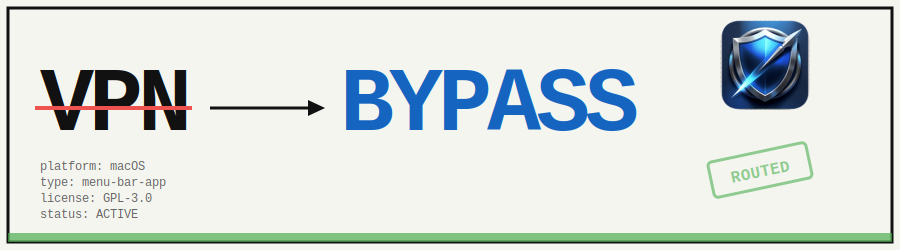
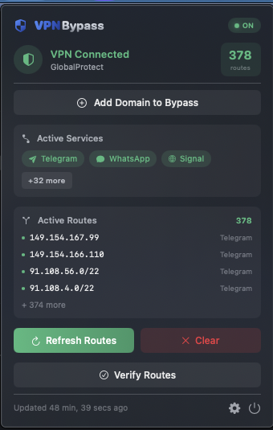
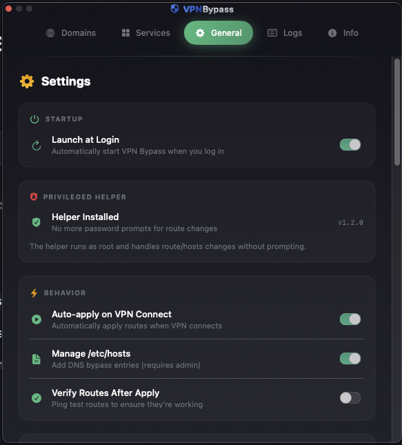

<p align="center">
  
</p>

<p align="center">
  
</p>

<h1 align="center">VPN Bypass</h1>

<p align="center">
  A macOS menu bar app that automatically routes specific domains and services around your VPN, ensuring they use your regular internet connection.
</p>

<p align="center">
  
  
  <a href="https://github.com/GeiserX/VPN-Bypass/releases"></a>
  <a href="https://github.com/GeiserX/VPN-Bypass/stargazers"></a>
  <a href="https://github.com/GeiserX/VPN-Bypass/blob/main/LICENSE"></a>
</p>

## Why?

Corporate VPNs often route all traffic through the tunnel, which can cause issues:

- **Performance**: Streaming and messaging apps become slow or buffer constantly
- **Broken features**: Chromecast, AirPlay, and location-based features fail
- **Unnecessary load**: Non-business traffic clogs the VPN tunnel
- **Privacy**: Personal services don't need to go through corporate infrastructure

VPN Bypass intelligently routes selected services directly to the internet while keeping business traffic secure through VPN.

## Features

- 🎯 **Menu bar app** - Quick access to status and controls
- 🌐 **Custom domains** - Add any domain you want to bypass
- 🔧 **Built-in services** - Telegram, YouTube, WhatsApp, Spotify, Tailscale, and more
- 🔄 **Auto-apply** - Routes are applied automatically when VPN connects
- 📋 **Hosts file management** - Optional DNS bypass via `/etc/hosts`
- 🪵 **Activity logs** - See what's happening in real-time
- 🔍 **VPN Detection** - Supports GlobalProtect, Cisco, Fortinet, Zscaler, Cloudflare WARP, and more
- 📶 **Network Monitoring** - Detects VPN and network changes automatically
- 🔔 **Notifications** - Alerts when VPN connects/disconnects and routes are applied
- ✅ **Route Verification** - Ping tests to verify routes are actually working
- 💾 **Import/Export Config** - Backup and restore your configuration
- 🚀 **Launch at Login** - Start automatically when you log in
- 🔄 **Auto DNS Refresh** - Periodically re-resolves domains and updates routes

<details>
<summary><h3>📸 Screenshots</h3></summary>

<p align="center">
  
  &nbsp;&nbsp;&nbsp;
  
</p>

</details>

## Installation

### Homebrew (Recommended)

```bash
# Add the tap (first time only)
brew tap geiserx/vpn-bypass

# Install VPN Bypass
brew install --cask vpn-bypass
```

Or install directly from the repository:

```bash
brew install --cask --no-quarantine https://raw.githubusercontent.com/GeiserX/VPN-Bypass/main/Casks/vpn-bypass.rb
```

### Manual Download

Download the latest `.dmg` from [Releases](https://github.com/GeiserX/VPN-Bypass/releases), open it, and drag **VPN Bypass** to your Applications folder.

### Build from Source

```bash
# Clone the repository
git clone https://github.com/GeiserX/VPN-Bypass.git
cd VPN-Bypass

# Build and create release DMG
make release

# Or just build and run
make run
```

### Xcode

Open `Package.swift` in Xcode and run the project.

## Usage

### Menu Bar

Click the shield icon in the menu bar to:
- See VPN connection status and type
- View active bypass routes
- Quick-add domains to bypass
- Refresh or clear routes
- Verify routes are working

### Settings

Click the gear icon to access settings:

**Domains Tab**
- Add custom domains to bypass
- Enable/disable individual domains
- See resolved IPs

**Services Tab**
- Toggle built-in services (Telegram, YouTube, Spotify, etc.)
- Each service includes known domains and IP ranges

**General Tab**
- Launch at Login toggle
- Auto-apply routes when VPN connects
- Manage `/etc/hosts` entries
- Enable route verification after apply
- Notification preferences (connect, disconnect, routes, failures)
- Import/Export configuration backup
- Network status display (VPN type, interface, gateway, WiFi SSID)

**Logs Tab**
- View recent activity
- Debug connection issues

## Supported VPN Types

| VPN Client | Detection |
|------------|-----------|
| GlobalProtect | ✅ Full |
| Cisco AnyConnect | ✅ Full |
| OpenVPN | ✅ Full |
| WireGuard | ✅ Full |
| Fortinet FortiClient | ✅ Full |
| Zscaler | ✅ Full |
| Cloudflare WARP | ✅ Full |
| Pulse Secure | ✅ Full |
| Check Point | ✅ Full |
| Tailscale (exit node) | ✅ Full |
| Tailscale (mesh only) | ❌ Not VPN |

## How It Works

1. **VPN Detection**: Monitors network interfaces and running processes to detect VPN type
2. **Gateway Detection**: Identifies your local gateway (Wi-Fi/Ethernet router)
3. **Route Management**: Adds host routes to send specific traffic through local gateway instead of VPN
4. **Route Verification**: Optionally pings routes to verify they're working
5. **DNS Bypass**: Optionally adds entries to `/etc/hosts` to bypass VPN DNS

### VPN Detection Logic

The app intelligently detects corporate VPNs while avoiding false positives:

| Interface Type | IP Range | Detection |
|---------------|----------|-----------|
| **Corporate VPN** (GlobalProtect, Cisco, etc.) | `10.x.x.x`, `172.16-31.x.x` | ✅ Detected as VPN |
| **Cloudflare WARP** | `100.96-111.x.x` | ✅ Detected as VPN |
| **Tailscale** (mesh networking) | `100.64-127.x.x` | ❌ Not detected* |
| **Tailscale** (exit node active) | `100.64-127.x.x` | ✅ Detected as VPN |

**\*Tailscale in normal mode** only routes traffic to other Tailscale devices. It's not a "full VPN" because your regular internet traffic still goes through your normal connection. The app only considers Tailscale as a VPN when you're using an **exit node** (routing all traffic through another Tailscale device).

The detection also requires:
- The interface must have the `UP` flag (actually connected, not just configured)
- The interface must have an IPv4 address in a VPN range

## Requirements

- macOS 13.0 (Ventura) or later
- Admin privileges (for route management and hosts file)

## Permissions

The app requires:
- **Network access**: To detect VPN connections and resolve domains
- **Admin privileges**: To add routes and modify `/etc/hosts` (prompted when needed)
- **Notifications**: Optional, for VPN status alerts (prompted on first launch)

## Troubleshooting

### Routes not being applied

1. Check if VPN is actually connected (look for utun interface)
2. Verify local gateway is detected in Settings → General
3. Check Logs tab for errors
4. Use "Verify Routes" button to test connectivity

### Hosts file not updating

The app will prompt for admin password when modifying `/etc/hosts`. If you deny, disable this feature in Settings → General.

### DNS still going through VPN

Some VPNs force DNS through the tunnel. The hosts file entries help bypass this, but you may also need to:
- Disable "Route all DNS through VPN" in your VPN client
- Use a local DNS resolver

### Route verification failing

If routes are applied but verification fails:
- The destination host may be blocking ping (ICMP)
- Try accessing the service directly - it may still work
- Check if the service is actually accessible from your network

## Contributing

Contributions are welcome! Here's how you can help:

1. **Report bugs** - Open an [issue](https://github.com/GeiserX/VPN-Bypass/issues) with details
2. **Suggest features** - Use the feature request template
3. **Submit PRs** - Fork, create a branch, and submit a pull request

Please read the issue templates before submitting.

## License

This project is licensed under the [GPL-3.0 License](LICENSE).
