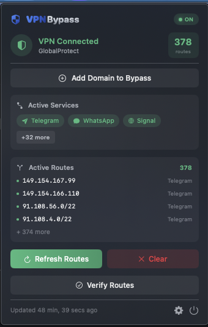
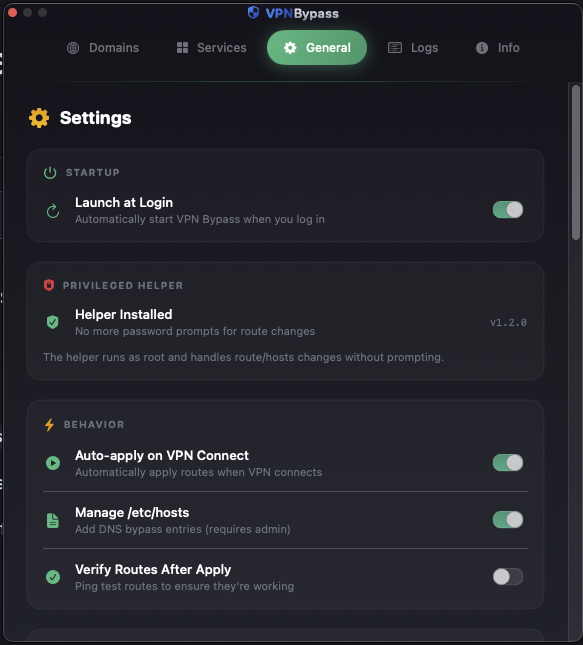

<p align="center">
  
</p>

<h1 align="center">VPN Bypass</h1>

<p align="center">
  A macOS menu bar app that controls what goes through your VPN. Route specific domains and services
  <em>around</em> the VPN, force only some <em>through</em> it, or, in Custom mode, send each domain,
  service or subnet out a route you choose: direct, a specific VPN, an HTTP/SOCKS5 proxy, or a Tailscale peer.
</p>

<p align="center">
  <a href="https://github.com/GeiserX/VPN-Bypass/releases"></a>
  <a href="https://github.com/GeiserX/VPN-Bypass/actions/workflows/ci.yml"></a>
  
  <a href="https://github.com/GeiserX/VPN-Bypass/stargazers"></a>
  <a href="https://github.com/GeiserX/VPN-Bypass/blob/main/LICENSE"></a>
</p>

Corporate VPNs often send all traffic through the tunnel, so streaming slows down, AirPlay and Chromecast break, and personal traffic crosses corporate infrastructure. VPN Bypass routes the services you pick straight to the internet and keeps business traffic on the VPN.

## Features

- Menu bar app with status, mode and controls.
- Three routing modes: **Bypass** (default), **VPN Only**, and **Custom** per-rule routing where the first match wins.
- Custom domains plus built-in service packs (Telegram, YouTube, WhatsApp, Spotify, Tailscale and more).
- Egress through the local gateway, a specific VPN interface (multi-VPN), an HTTP/SOCKS5 proxy, or a Tailscale peer.
- `vpnb` CLI that scripts the app over a user-only socket.
- Re-applies routes when the VPN connects or the network changes, and re-resolves domains as IPs rotate.
- Detects GlobalProtect, Cisco, Fortinet, Zscaler, Cloudflare WARP, Tailscale exit nodes and more.
- Optional `/etc/hosts` DNS bypass, route verification, notifications, logs, import/export and launch at login.
- A small root helper does the routing. It is cdhash-pinned to this app and needs no Network Extension entitlements.

<details>
<summary><h3>📸 Screenshots</h3></summary>

<p align="center">
  
  &nbsp;&nbsp;&nbsp;
  
</p>

</details>

## Quick start

```bash
brew tap geiserx/vpn-bypass
brew trust --cask geiserx/vpn-bypass/vpn-bypass
brew install --cask vpn-bypass
```

Needs macOS 13 or later. The DMG download and building from source are in [Installation](docs/installation.md). If macOS says the app is damaged, see [Troubleshooting](docs/troubleshooting.md).

## Documentation

- [Installation](docs/installation.md): Homebrew, DMG, source, Xcode, requirements and permissions
- [Routing modes, routes and rules](docs/routing.md)
- [Usage](docs/usage.md): menu bar, settings tabs and the `vpnb` CLI
- [How it works](docs/how-it-works.md): supported VPNs and detection logic
- [Running alongside other VPNs and proxies](docs/COEXISTENCE.md)
- [Troubleshooting](docs/troubleshooting.md)
- [Development and contributing](docs/development.md)
- [Changelog](docs/CHANGELOG.md) and [roadmap](ROADMAP.md)

## License

This project is licensed under the [GPL-3.0 License](LICENSE).

This project is made possible by generous supporters: **Lee**.
