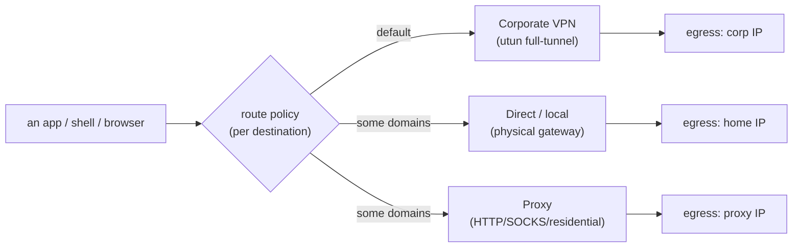
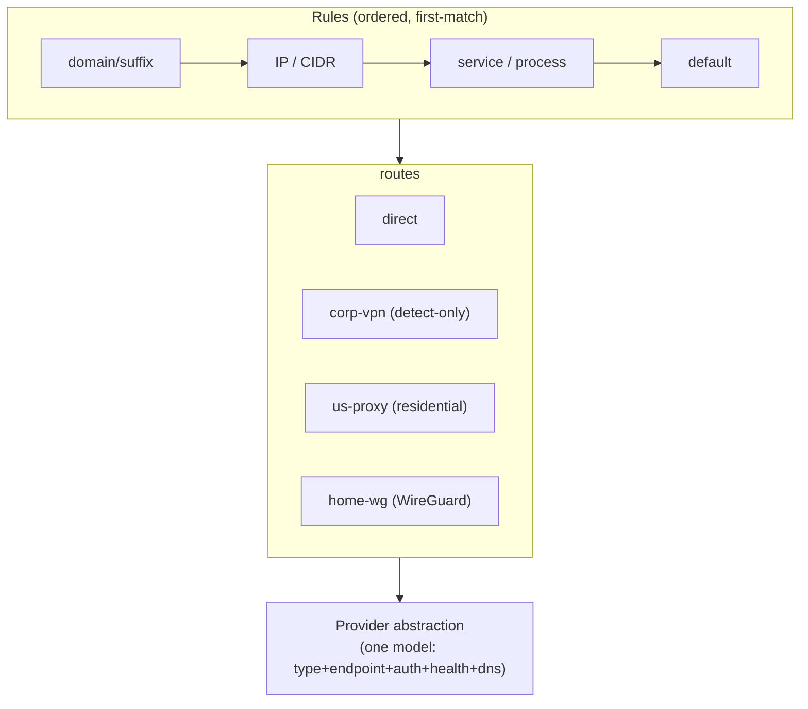

# Multi-Route Networking — design & handoff

> **Status: P0 + P1 SHIPPED in 3.0.** The routes+rules model (P0) and the proxy local-listeners + `route-on`
> hook + `vpnb` CLI (P1) landed in 3.0, along with Tailscale-peer & multi-VPN egress and the Custom-mode UX
> (build Slices 1–4). **The remaining track is P2 — app-agnostic capture of proxy-ignoring apps — and it is
> entitlement-free (PF + a local CA), NOT Network Extension** (see the NO-NE hard-constraint section near the
> end; it supersedes every mention of `NETransparentProxy` in the body below).
> This document is the handoff for turning VPN Bypass from a
> two-way *"bypass the VPN for these domains"* tool into a general **multi-route router**: any
> destination can take any of **N named routes** — the corporate VPN (default), one or more **proxies**
> (HTTP/SOCKS, including residential like Oxylabs / Bright Data / IPRoyal), or **direct** — and any app
> (iTerm, shells, browsers) can **hook into** a chosen route with minimal friction.
>
> **Generalistic by design.** Most users will not have Oxylabs; they'll have a corporate VPN and maybe a
> WireGuard/OpenVPN endpoint. Residential proxies must be a *first-class* route type, but never the only
> one. The system models **any** provider behind one abstraction.

## Why this is its own category

Routing today is implicit and binary (in the tunnel, or routed around it). Real use needs a **policy**:
*"this destination → that route."* We already run this by hand and it works — but it's hardcoded to one
proxy, fragile, and not exposed as a product surface. We also hit a live **transient API error** when the
single proxy path blipped, with no failover — which is the whole argument for making routing a solid,
first-class, multi-route system with health-checks and fallback.

## What we already proved (the seed)

On a corporate-VPN (GlobalProtect, full-tunnel) Mac we ran **three simultaneous routes**, per-destination:

| Route | Used for | Mechanism (today) |
|---|---|---|
| **Corporate VPN** (default) | everything unlisted | the OS default route → the VPN's `utun` |
| **Residential proxy** (e.g. Oxylabs, pinned IP) | one app's traffic that must present a stable residential IP | shell `HTTPS_PROXY=http://…@host:port`, **+** VPN Bypass host-routes the proxy's IPs out of the tunnel so the proxy hop is reachable |
| **Direct / local** | messaging + streaming (Telegram, WhatsApp…) | VPN Bypass host-routes those domains' IPs via the physical gateway |



**Two hard lessons from the seed** (must be designed-in, not bolted-on):

1. **DNS follows the wrong route.** Under a full-tunnel VPN, the *hostname lookup* is answered by the
   corporate DNS even when the destination IP is routed around the tunnel — so a hostname-based proxy URL
   fails (`ConnectionRefused`) while an IP-based one works. We fixed it by resolving with `dig` (which used
   the non-tunnel resolver) and **pinning the proxy by IP**. The general system needs **per-route DNS**:
   each route resolves names through the resolver appropriate to that route, not the OS default.
2. **The VPN re-asserts routes / blocks the hop.** Host-routes around a corporate VPN can be clobbered or
   the proxy host blocked. The system needs continuous re-assertion (VPN Bypass already does this) and, for
   robustness, an OS-level intercept rather than only routing-table tricks (see *macOS implementation*).

## Where VPN Bypass is today (the starting point)

`RouteManager.Config` is effectively a **2.5-route** model:

- `domains[] / services[]` — destinations to **bypass** the VPN (route **direct**).
- `routingMode` — `bypass` (listed go direct, rest VPN) **or** `vpnOnly` (only listed go VPN, rest direct).
- `proxyConfig` — **one** SOCKS5 proxy + `useForServices[]` (which services use it). *This is the embryo of
  multi-route* — but it's a single, hardcoded proxy, off by default.

So the primitives exist (a bypass list, a notion of "some services use a proxy"); they're just not
generalized into **N named routes + a per-destination selector**.

## The generalization: **routes + rules + providers**

Adopt the model every serious router uses (clash / sing-box / Surge: *outbounds + rules + selectors*).
Two new concepts, one schema change:

- **Route** = a named egress with a typed **provider** (the *outbound*). Examples: `corp-vpn`,
  `us-proxy`, `home-wireguard`, `direct`.
- **Rule** = a matcher → a route name (the *selector*). Examples: `domain:*.example-api.com → us-proxy`,
  `service:telegram → direct`, `default → corp-vpn`.



`Config` evolves to roughly `{ routes: [Route], rules: [Rule] }`. The current model maps in cleanly
(backward-compatible): the bypass list becomes `… → direct` rules; `vpnOnly` becomes a `default →
corp-vpn` with explicit `… → direct` rules; the single `proxyConfig` becomes one `Route` of provider type
`socks5`. A migration converts old configs on first load.

## Provider abstraction (route types)

The model every serious router converges on (sing-box, Clash Meta, Surge): a **typed outbound** — one
schema, each route type a variant — so the rest of the system stays provider-agnostic.

- **Route types:** `direct` · `vpn-detected` (the OS's corporate VPN — *detect-only*: we route **around**
  it, we don't drive it) · `http` · `socks5` · `residential-rotating` (new IP per connection) ·
  `residential-sticky` (a session-id in the username pins the IP for a TTL) · `dedicated-isp`
  (**port = a fixed IP**, zero per-request overhead) · `wireguard` · `openvpn` · `ikev2` · `tailscale-exit`.
- **Common fields:** `tag` (unique name), `type`, `enabled`, `endpoint {host, port}`,
  `auth {user, pass, tls?}`, `dns` (the resolver *for this route* — see lesson #1), `health {url, interval,
  expectBodyContains?}`, `geo {country, asn, isp, residential}`.
- **Session control (residential):** `mode: rotating | sticky | port-pinned`. Sticky adds `ttl` +
  `sessionFormat` (e.g. `{user}-sessid-{id}-sesstime-{ttl}`) so different providers' username encodings
  aren't hardcoded; port-pinned adds a `portMap` (label → port) the daemon can expand into one listener
  per slot.
- **`_runtime`** (daemon-managed, never hand-edited): the assigned `localPort` + `localUrl`,
  `healthStatus`, `observedIp`.

> All credentials/endpoints above are **placeholders** — no real values live in this public doc; they
> stay in the app's existing secure config.

Closest references: **sing-box** (every outbound is `{type, tag, …}`; the `selector`/`urltest` *groups are
themselves outbounds*; `detour` cleanly chains one outbound through another — e.g. a proxy whose own
connection exits via the VPN) and **Proxifier**'s 3-section split (proxies → chains → rules) for human
clarity. *(See open questions for which selector types ship in v1.)*

## macOS implementation

**Decision (from research): the OS-level engine is `NETransparentProxyProvider`** *(superseded — see the
NO-NE hard-constraint section below; the shipped path is entitlement-free, and NE is out)* (a Network System
Extension). It is the *only* mechanism that reliably intercepts a workstation's **own** outbound flows
per-destination — and it hands the handler the **hostname before DNS** (`flow.remoteHostname`), which is
exactly what makes domain-based routing *and* the DNS fix possible. mitmproxy (local mode), ProxyBridge,
Antify, and Surge all converge on it.

Per-flow handler logic (`handleNewFlow`):
- **VPN route** → return `false` (the OS keeps the flow on the VPN's default).
- **Proxy route** → open the route's upstream and `CONNECT <hostname>:<port>` (SOCKS5 ATYP=domain / HTTP
  CONNECT). **The proxy resolves the name remotely → no local DNS at all, which is precisely how we dodge
  the "corporate DNS captures the lookup" bug** we hit with the hostname proxy URL.
- **Direct route** → open a socket **bound to the physical interface's IP** (`en0`); the kernel then routes
  it out `en0` *regardless of the VPN's routing table* (this is Surge "Enhanced Mode") — robust against the
  VPN re-asserting routes, with no host-route chasing.

Per-route **DNS**: proxy routes need none (the proxy resolves); direct routes resolve via the
interface-bound socket; everything else uses **`/etc/resolver/<domain>` files** pointing at a non-VPN
resolver. (`NEDNSSettings.matchDomains` inside a transparent proxy is **silently ignored** by macOS —
`/etc/resolver` is the working path.)

**Explicitly rejected (research-confirmed):** **PF `rdr`** cannot redirect the box's *own* traffic (it only
applies to packets arriving from other devices) — the redsocks pattern is out for a workstation.
**Routing-table host-routes** stay only as a *fallback* for non-extension processes (daemons), with a
route-change watchdog to re-apply on VPN resets — they can't reach a proxy upstream.

**Cost / sequencing:** the NE extension needs restricted entitlements (`networkextension` transparent-proxy
+ `system-extension.install`), Developer ID signing, and one-time user approval. So **P1 (per-route local
listeners + `route-on`) ships first with zero entitlements** (just local proxy listeners + the proxy env —
today's `oxy-on`, generalized) and already delivers the proven 3-way; **P2 (the NE engine) is the
app-agnostic upgrade** for traffic that ignores a proxy env (curl-without-`-x`, Go/Rust binaries, daemons).
*(Superseded — the app-agnostic upgrade is now the entitlement-free PF/CA transparent path, NOT NE; see the
NO-NE hard-constraint section below. P1 shipped in 3.0.)*

## Hookability — how an app picks a route

The friction-free hook is a **per-route local listener**: VPN Bypass runs one `127.0.0.1:PORT` listener
**per configured route**, so *any* app routes through a provider just by pointing at a plain proxy URL —
no knowledge of the provider's type or auth:

```
route "us-proxy"  → http://127.0.0.1:18101   (forwarder injects the route's proxy auth, escapes the VPN)
route "home-wg"     → http://127.0.0.1:18102
route "direct"      → (no proxy; or a pass-through listener)
```

- **Shell / iTerm:** a generalized `route-on <name>` (today's `oxy-on`, made provider-agnostic) exports
  `HTTPS_PROXY=http://127.0.0.1:<port-for-name>` for that shell only. iTerm "hooks in" with one command.
- **Browser:** a generated **PAC file** maps URL patterns → the per-route listeners (per-URL routing
  in-browser).
- **System / per-app:** optional system-proxy or per-app assignment.

This keeps the hook **trivial and generic** (a proxy URL) while the provider complexity stays inside VPN
Bypass. *(Listener-port assignment + the `route-on` CLI design come from the hookability research.)*

## Credentials & token refresh

- Each route stores its own credential (proxy user/pass, WireGuard keys, etc.) in the app's existing
  secure config; never logged.
- **Refreshing a credential *through* a route.** Some upstream services rate-limit or block credential /
  token refresh that doesn't originate from a consistent, real-browser-looking session on the *same* egress
  IP. A route should therefore be able to host a **browser-backed refresh helper**: renew the token in a
  real browser session that exits through *that route's* IP, then reuse the token across many uses. Design
  it to be **efficient** (reuse one long-lived token; don't re-auth per use) but **solid** (renew via a real
  browser bound to the route's egress, never a raw automated request). The login/refresh is a *separate,
  deliberate step* — never paired with every connection.

## Resolved by research / still open

**Resolved:**
- **Engine** → `NETransparentProxyProvider` *(superseded — NE is out; the engine is the entitlement-free
  kernel-routes + local-listener path, with a PF/local-CA transparent track for app-agnostic capture. See the
  NO-NE hard-constraint section below.)* (PF-`rdr` rejected as a redsocks-style redirect — it can't touch the
  box's own traffic).
- **Per-route DNS** → proxy routes: the proxy resolves remotely; direct: interface-bound resolve; else
  `/etc/resolver/<domain>` (`NEDNSSettings.matchDomains` is silently ignored).
- **Schema** → typed-outbound (sing-box model) + the three residential session modes (see *Provider abstraction*).
- **Selectors** → ship `manual` + `url-test` + `fallback` in v1 (universal; the `tolerance` field prevents
  exit-IP thrashing); `load-balance` later.

**Still open:**
- Back-compat migration of today's `Config` (bypass list + single SOCKS5 proxy) → `routes[] + rules[]`.
- Vendor a Network-System-Extension target now (signing + restricted-entitlement plumbing), or stay on the
  P1 local-listener path until there's real demand for app-agnostic interception?
- Sticky-session username encodings: one `sessionFormat` string vs per-provider presets.

## Phased plan

- **P0 — model:** add `routes[] + rules[]` to `Config` (back-compat migration); keep current behavior as
  `direct`/`vpn` routes. No new engine yet.
- **P1 — proxy route + local listeners:** generalize the single `proxyConfig` into N proxy routes, each
  with a `127.0.0.1:PORT` forwarder (the `oxy-on` forwarder, made general + auth-injecting + VPN-escaping).
  Ship `route-on <name>`. This alone delivers the proven 3-way, generically.
- **P2 — app-agnostic capture:** *(superseded — NE is out; see the NO-NE hard-constraint section below.)* the
  entitlement-free **PF + local-CA** transparent path (not `NETransparentProxy`) for app-agnostic
  per-destination routing + per-route DNS + health-check/failover selectors.
- **P3 — providers:** WireGuard/OpenVPN/Tailscale route types; PAC for browsers; UI for routes+rules.

## 2026-07-03 — Research corrections + locked build plan

A fresh directive ("the definitive macOS routing manager": multiple VPNs, multiple proxies, direct,
Tailscale, easy UX, plus a scripting surface) triggered a second research panel + a **live probe of the
actual machine**. Several assumptions above are now corrected. This section is authoritative where it
conflicts with the older text; the older sections are kept for history.

### Corrections from live evidence (see `docs/research/2026-07-03-tailnet-probe.md`)

1. **The reference machine's GlobalProtect is SPLIT-tunnel, not full-tunnel.** `route -n get 8.8.8.8` →
   `en8` (home WAN), not the GP utun. GP only captures corporate CIDRs (a `/32` + `100.112.0.0/12`). The
   "escape the full-tunnel VPN" framing still matters for *other* users (Cisco/Zscaler full-tunnel) so we
   keep the physical-NIC upstream binding for internet proxies — but the baseline for general traffic is
   already "direct".
2. **Per-destination "route via my Tailscale server" MUST be proxy-over-tailnet — NOT kernel-routing into
   the Tailscale utun.** Confirmed two ways (WireGuard cryptokey-routing drops any dest not in the peer's
   AllowedIPs; Tailscale only injects a route via an *approved subnet route* or a *selected exit node*; and
   macOS exit-nodes are **all-or-nothing**, no per-destination split — Tailscale issues #7766/#13677 still
   open). Forcing `route add -host <public-ip> -interface utunX` is silently dropped. The **only**
   inherently per-destination Tailscale mechanism: run an ordinary forward proxy on a peer bound to its
   tailnet IP (`100.x:port`), and dial it as a normal proxy route. Tailnet peer IPs are unconditionally
   reachable with **zero** Tailscale config changes. This reuses the existing `ProxyForwarder` wholesale.
3. **No usable forward proxy exists on the tailnet today.** Probed peer-relay, peer-server-b, a tailnet peer — all
   forward-proxy ports closed. peer-server-b:8080 looked like Squid but is a **Tomcat reverse-proxy** (CONNECT →
   501). So P2 requires standing up a small forward proxy (tinyproxy/3proxy) on a peer — an infra step,
   trivial given all peers run Docker via webhook GitOps. a tailnet peer `<tailnet-peer-ip>` is the target for the
   "via the a tailnet peer" use case.
4. **DNS leak rule for proxy-over-tailnet:** the dialing side must use **remote resolution** (SOCKS5h /
   HTTP CONNECT with the hostname), so the lookup happens at the peer, not through GP's resolver. Our
   `ProxyForwarder` already does HTTP `CONNECT <host>:<port>` (remote DNS) — correct by construction.
5. **Landmine:** GP's `100.112.0.0/12` overlaps Tailscale's CGNAT `100.64.0.0/10`. A tailnet peer whose IP
   is in `100.112–100.127` (e.g. the existing `nuc` at 100.114.x) is longest-prefix-hijacked into GP while
   GP is up. **Guard:** refuse/warn on a Tailscale-peer route whose resolved IP ∈ `100.112.0.0/12` while
   `vpnType == .globalProtect`. a tailnet peer (100.95) and peer-relay (100.68)/peer-server-b (100.73) are safe.

### Locked architecture (supersedes "macOS implementation" P2=NE-first framing for THIS release)

- **Egress model:** do NOT add new `Egress` cases for specific VPNs (a new rawValue makes *old* builds
  coerce it to `.direct` on decode = a **leak**). Instead add optional fields on `Route` (old builds
  ignore them → degrade to the safe "primary VPN"/"physical NIC" default). New enum cases only with a
  `schemaVersion` bump that makes old builds refuse rule-dispatch (fall back to legacy) rather than
  mis-route.
- **Keep the legacy `routingMode` engine as the default apply path.** Make `rules[]+routes[]` a pure,
  unit-tested **`RouteCompiler`** that emits the *same* `routesToAdd` batch the four apply paths already
  build (`applyAllRoutesInternal` 1376, `applyRoutesFromCache` 1739, `backgroundDNSRefresh` 1955,
  `performDNSRefresh` 2248), gated by `schemaVersion >= 2 && multiRouteEnabled`. No fork of the four paths;
  the shared `addRoutesBatch`→epoch/orphan/hosts tail is untouched. This preserves the hard-won GP-teardown
  guards instead of re-deriving them in a second engine.
- **The helper already routes into any utun** (`HelperTool.buildRouteAddArgs` emits
  `route -n add -host <dest> -interface utunX` for any `iface:<name>`, name-validated). Multi-VPN egress is
  *wiring*, not new privileged plumbing. `vpnOnly` already uses `iface:<vpnInterface>`.
- **VPN attribution:** refactor detection to return `[VPNLink]` (all live tunnels), scored by a ladder:
  `tailscale status --json` (authoritative for the TS utun) → `scutil --nc list` (NE product names) →
  running-process family → address/gateway shape. Reject `lsof`/`pfctl` owner as a primary signal. Manual
  picker as the honest floor; **persist the utun mapping by a stable fingerprint (product + subnet +
  scutil name), never the utun index** (indices renumber across reconnects).
- **Guards (generalize `refuseVPNOnlyUnderGlobalProtect`):** refuse any catch-all (`0/1`,`128/1`,`0/0`)
  into a non-primary egress under GP; refuse `iface:` into an absent interface (re-resolve every apply);
  extend `shouldSkipReapply` to key on `destination|gateway` (gateway now varies per rule).
- **Health & fallback:** per-route `FallbackPolicy` (`failClosed | toDefault | toRoute`) defaulting
  **fail-closed** for proxy/residential routes (a silent fall-through to the wrong exit IP is worse than
  failing — the incident that motivates the whole project). Kernel dests fail-closed via a blackhole route;
  proxy-listener dests return 502. Menu bar must show each route's health **and the active egress**. Be
  honest: a true *global* kill-switch needs the P2/NE engine, not the routing table.

### UX (locked — the "really easy" requirement)

- **Fold `multiRouteEnabled` into `routingMode` as a third case:** `bypass` (default, unchanged) ·
  `vpnOnly` (unchanged) · `custom`. Move the mode choice to a persistent 3-segment picker **above the tab
  bar** (retire the buried General→Experimental toggle and the in-Domains-tab mode card).
- **Simple modes stay a single tap and byte-identical to today.** Existing users who never pick "Custom
  Routes" see zero change.
- **Custom mode = two tabs mirroring the model:** a **Rules** tab (ordered, first-match; each row's *Route
  chip* is the one control that assigns a destination to an egress; a pinned "Everything else → default"
  row) + a generalized **Routes** tab (auto-detected **System Routes** = each VPN link + Direct, plus
  user-created **Your Routes** = proxies + Tailscale peers). Switching *into* Custom runs the existing
  `derive()` migration **visibly** ("we converted your N domains/services into rules"); switching out warns
  that non-direct/VPN routes are paused, not deleted.
- **Transparent delivery for proxy routes** (so no more manual iTerm profiles): VPN Bypass can install a
  **system PAC** (already generated by `HookGenerator.pac`) mapping the per-domain rules to the right
  loopback listener and everything else to `DIRECT` — transparent for any app honoring the system proxy;
  the `route-on` shell hook + per-route env stay for CLI tools that ignore it. (Full app-agnostic capture
  of proxy-ignoring binaries is still the later P2/NE track.)
- Menu bar: Custom shows a "Custom Routes" badge + a "Switch to Bypass" escape hatch and a "Routes In Use"
  rollup (distinct from the existing kernel "Active Routes" section). Copy strings are specified in the UX
  memo captured in the worklog.

### Scripting / automation surface (new requirement — generic, no per-provider integrations) — LOCKED

- **Verbs over the app's OWN model only** (routes/rules/mode/status) — the app never learns "Oxylabs" or
  any vendor API. Canonical use case: a script re-points a route's upstream host/port (switch an Oxylabs
  dedicated-ISP port = switch exit IP) and the listener reconciles live.
- **PREREQUISITE BUG (Phase A.5, fix in Slice 1):** `ProxyListenerManager.reconcile` currently keys only on
  route **id** — a route whose id is unchanged but whose host/port/creds/template/sessionMode changed is
  neither stopped nor started, so the forwarder keeps the `Upstream` captured at construction. Thus
  "re-point a route's port live" is a **no-op today**, and the same bug bites the Routes UI when editing an
  existing proxy route. Fix: fingerprint each route's upstream (`host|port|user|pass|userTmpl|passTmpl|
  sessionMode|ttl`); when the fingerprint changes for a live id, stop+restart that one forwarder. Tiny,
  standalone, unblocks live re-point for BOTH the CLI and the GUI edit flow. (The same restart primitive
  later powers a `route.rotate` verb for rotating/sticky sessions.)
- **Transport (LOCKED): a bundled `vpnb`/`vpnbypass` CLI (a second SwiftPM executable target, cask-symlinked
  to PATH) talking to the running app over a user-only UNIX domain socket** — `~/Library/Application
  Support/VPNBypass/control.sock`, dir `0700`, socket `0600`, **no TCP**. Filesystem perms are the auth
  (same-user only, which is who the app runs as); optional belt-and-suspenders peer-code check mirrors the
  helper's `SecCodeCheckValidity`. This is the unprivileged analog of the existing privileged-helper XPC.
- **Architecture:** a pure `CommandRouter` enum (`{cmd,args} → RouteManager mutation`), unit-tested exactly
  like `RuleResolver`/`HookGenerator`; a thin `ControlSocketServer` (own queue, `NWListener` on
  `NWEndpoint.unix(path:)`) does framing + `MainActor.run { router.dispatch }`. The socket mutates
  `RouteManager` config + listeners only; kernel-affecting verbs go through the SAME apply path a GUI action
  does (GP catch-all refusal, helper-readiness, epoch preemption all inherited) — **no new privilege path,
  no capability the GUI user lacks**. Because both Settings and the menu bar bind the one `RouteManager.shared`,
  a scripted change auto-refreshes both surfaces via existing SwiftUI reactivity (no new refresh mechanism).
  Guard the handler with the existing `acquireRouteOperation()` lock so a script + GUI edit don't race.
- **Credentials never echoed:** the CLI reads secrets from **stdin or env, never argv** (argv is world-
  visible in `ps` + shell history) — e.g. `vpnb route set <id> port=… pass:-` (`pass:-` = read from stdin).
  Replies/logs reuse the `sanitizedForExport` discipline: "route X upstream updated", never the value.
- **Schema versioning:** newline-delimited JSON, envelope versioned on its OWN `v` axis (independent of
  `config.schemaVersion`); additive verbs/args don't bump `v`; a breaking change bumps `v` and the app
  accepts `v`+`v-1` for a window; unknown `v` → clear error, never silent misparse. `status` advertises
  supported `v` + `schemaVersion` for feature-detection.
- **UX (from the design addendum):** an "Automation" card in General (the retired Experimental slot) with
  the CLI path + a copy-able cheat-sheet; a split Copy control on RouteRow ("Copy Shell Exports" / "Copy CLI
  Command") and a "Copy CLI Command" item in RuleRow's overflow; log provenance `… via CLI`; a transient
  row highlight on externally-sourced changes. App-not-running fallback: CLI writes config.json directly but
  says so explicitly (`--queue` to apply on next launch), never a silent surprise.
- **Rejected as primary:** config-file-watch (no validation, plaintext-secret-in-file, second writer racing
  `saveConfig()` — folded in only as an explicit `reload` verb, NOT an FSEvents watcher); AppleScript/App
  Intents (poor secret passing, resign/OS churn — later, as a thin shim over the same `CommandRouter`);
  localhost-HTTP+token (a TCP port every local process can reach + token lifecycle + CSRF/rebinding — bad
  look on a security tool; only if remote control is ever needed, and then Tailscale-bound, never localhost).

### HARD CONSTRAINT (2026-07-03) — NO Network Extension entitlements, ever

Owner directive: *"Continue using these quirks with pf, CA, etc… I don't want to be using NE entitlements
or anything for this."* This **overrides** the "macOS implementation" section above where it names
`NETransparentProxyProvider` as the P2 engine. NE is **out** — it needs Developer-ID + notarization + a
system-extension approval, exactly the signing fork the owner rejects. The app stays ad-hoc-signable and
entitlement-free.

Consequences for the roadmap:
- **Kernel routes (`iface:utunX`, host-routes via the gateway) + userspace loopback proxies stay the whole
  engine.** Slices 2/4 (custom-mode rule dispatch, multi-VPN egress) use ONLY these — no NE.
- **App-agnostic / "transparent" capture** (apps that ignore `HTTPS_PROXY` — curl-without-`-x`, Go/Rust
  binaries) — the entitlement-free path is **PF + a local CA**, NOT NE: a PF `rdr`/`route-to` rule (or the
  system HTTP/HTTPS proxy + PAC) steers matched flows into a local transparent proxy that terminates TLS
  with a **user-installed local CA** (mitmproxy-style) to read the SNI/hostname for domain routing. This
  needs its own research slice (PF's limits on the host's *own* outbound traffic; CA trust install UX) —
  tracked as the "transparent PF/CA" track, replacing the old NE-based P2. It is NOT required for Slices
  2/4, which route by IP/CIDR at the kernel level and by proxy-env at the userspace level.
- P3/NE bead `.10` and the signing-decision bead `.11` are effectively **closed as WON'T-DO** (NE rejected);
  re-scope `.10` to the PF/CA transparent track.

### Build order (each slice independently green + releasable; single release at the very end)

1. **Slice 1 — Tailscale-peer egress via proxy-over-tailnet + the live-re-point fix.** App-side: a Tailscale
   route = a proxy route whose upstream is a tailnet peer (`100.x : port`), `boundInterface = nil` (route via
   the TS utun, do **not** bind the physical NIC), remote-DNS by construction. Peer picker from
   `tailscale status --json`. `100.112/12`-under-GP guard. **Includes the Phase A.5 fingerprint fix** so
   editing a live route's host/port/creds restarts its forwarder (today a no-op — breaks both the UI edit
   flow and the scripting re-point use case). Reuses `ProxyForwarder`. Live-verified end-to-end (Mac →
   tailnet → a tailnet peer → internet; the mini's proxy log confirms the path).
2. **Slice 2 — UX mode overhaul.** `routingMode.custom` third case; mode picker above tabs; Rules tab +
   generalized Routes tab; visible `derive()` migration; the `.custom` branch through `setRoutingMode()` +
   the ~5 hardcoded binary call sites. Pure UI + plumbing; no new engine.
3. **Slice 3 — Scripting surface.** The `vpnbypass` CLI + user-only socket + live reconcile, per the locked
   security design (fold in the critic's guards).
4. **Slice 4 — Multi-VPN egress (the "4th way").** `Route.vpnSelector` + `[VPNLink]` attribution +
   `RouteCompiler` kernel dispatch into a *specific* utun, flag-gated at `schemaVersion >= 2`, with the
   generalized GP catch-all guard + regression tests. The only new kernel step; riskiest, ships last.
5. **Slice 5 — Health + fallback + system-PAC "transparent" toggle + final verification.**
6. **P2/NETransparentProxy stays out of scope** (app-agnostic capture + true global fail-closed) — gated on
   the signing-fork decision (`VPN-Bypass-3sc.11`).

## Tracking

VPN Bypass uses **GitHub issues + this ROADMAP**, not beads. Issues to file (see ROADMAP "Multi-Route"
section): the P0–P3 above, plus the per-route DNS and the residential-proxy sticky-session handling. The
consumer-side login/refresh ("do OAuth") work is tracked separately by the consuming project.

---
*Seeded 2026-06-30 from a live 3-way setup (VPN / proxy / direct). Technical sections are grounded in
parallel research on multi-route tool architectures (sing-box / Clash Meta / Surge / Proxifier), macOS
routing mechanisms (NETransparentProxy / PF / `/etc/resolver`), and the provider + hook abstraction.
Credentials and provider-specific values are deliberately kept out of this public doc.*
