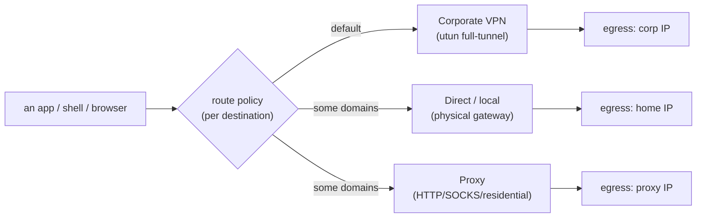
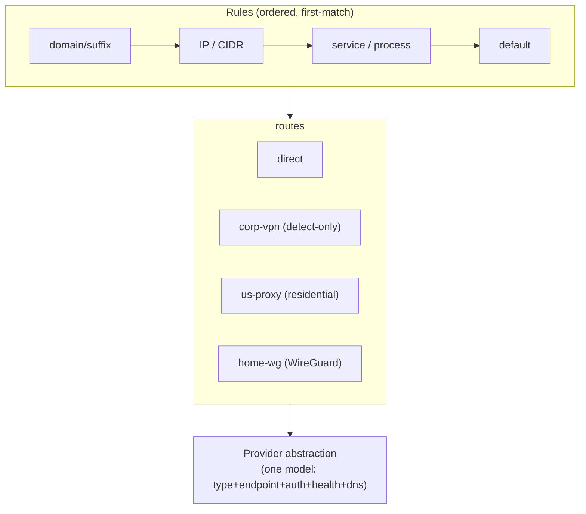

# Multi-Route Networking — design & handoff

> **Status: DESIGN (research in flight).** This document is the handoff for turning VPN Bypass from a
> two-way *"bypass the VPN for these domains"* tool into a general **multi-route router**: any
> destination can take any of **N named routes** — the corporate VPN (default), one or more **proxies**
> (HTTP/SOCKS, including residential like Oxylabs / Bright Data / IPRoyal), or **direct** — and any app
> (iTerm, shells, browsers) can **hook into** a chosen route with minimal friction.
>
> **Generalistic by design.** Most users will not have Oxylabs; they'll have a corporate VPN and maybe a
> WireGuard/OpenVPN endpoint. Residential proxies must be a *first-class* route type, but never the only
> one. The system models **any** provider behind one abstraction.

## Why this is its own category

Routing today is implicit and binary (in the tunnel, or routed around it). Real use needs a **policy**:
*"this destination → that route."* We already run this by hand and it works — but it's hardcoded to one
proxy, fragile, and not exposed as a product surface. We also hit a live **transient API error** when the
single proxy path blipped, with no failover — which is the whole argument for making routing a solid,
first-class, multi-route system with health-checks and fallback.

## What we already proved (the seed)

On a corporate-VPN (GlobalProtect, full-tunnel) Mac we ran **three simultaneous routes**, per-destination:

| Route | Used for | Mechanism (today) |
|---|---|---|
| **Corporate VPN** (default) | everything unlisted | the OS default route → the VPN's `utun` |
| **Residential proxy** (e.g. Oxylabs, pinned IP) | one app's traffic that must present a stable residential IP | shell `HTTPS_PROXY=http://…@host:port`, **+** VPN Bypass host-routes the proxy's IPs out of the tunnel so the proxy hop is reachable |
| **Direct / local** | messaging + streaming (Telegram, WhatsApp…) | VPN Bypass host-routes those domains' IPs via the physical gateway |



**Two hard lessons from the seed** (must be designed-in, not bolted-on):

1. **DNS follows the wrong route.** Under a full-tunnel VPN, the *hostname lookup* is answered by the
   corporate DNS even when the destination IP is routed around the tunnel — so a hostname-based proxy URL
   fails (`ConnectionRefused`) while an IP-based one works. We fixed it by resolving with `dig` (which used
   the non-tunnel resolver) and **pinning the proxy by IP**. The general system needs **per-route DNS**:
   each route resolves names through the resolver appropriate to that route, not the OS default.
2. **The VPN re-asserts routes / blocks the hop.** Host-routes around a corporate VPN can be clobbered or
   the proxy host blocked. The system needs continuous re-assertion (VPN Bypass already does this) and, for
   robustness, an OS-level intercept rather than only routing-table tricks (see *macOS implementation*).

## Where VPN Bypass is today (the starting point)

`RouteManager.Config` is effectively a **2.5-route** model:

- `domains[] / services[]` — destinations to **bypass** the VPN (route **direct**).
- `routingMode` — `bypass` (listed go direct, rest VPN) **or** `vpnOnly` (only listed go VPN, rest direct).
- `proxyConfig` — **one** SOCKS5 proxy + `useForServices[]` (which services use it). *This is the embryo of
  multi-route* — but it's a single, hardcoded proxy, off by default.

So the primitives exist (a bypass list, a notion of "some services use a proxy"); they're just not
generalized into **N named routes + a per-destination selector**.

## The generalization: **routes + rules + providers**

Adopt the model every serious router uses (clash / sing-box / Surge: *outbounds + rules + selectors*).
Two new concepts, one schema change:

- **Route** = a named egress with a typed **provider** (the *outbound*). Examples: `corp-vpn`,
  `us-proxy`, `home-wireguard`, `direct`.
- **Rule** = a matcher → a route name (the *selector*). Examples: `domain:*.example-api.com → us-proxy`,
  `service:telegram → direct`, `default → corp-vpn`.



`Config` evolves to roughly `{ routes: [Route], rules: [Rule] }`. The current model maps in cleanly
(backward-compatible): the bypass list becomes `… → direct` rules; `vpnOnly` becomes a `default →
corp-vpn` with explicit `… → direct` rules; the single `proxyConfig` becomes one `Route` of provider type
`socks5`. A migration converts old configs on first load.

## Provider abstraction (route types)

The model every serious router converges on (sing-box, Clash Meta, Surge): a **typed outbound** — one
schema, each route type a variant — so the rest of the system stays provider-agnostic.

- **Route types:** `direct` · `vpn-detected` (the OS's corporate VPN — *detect-only*: we route **around**
  it, we don't drive it) · `http` · `socks5` · `residential-rotating` (new IP per connection) ·
  `residential-sticky` (a session-id in the username pins the IP for a TTL) · `dedicated-isp`
  (**port = a fixed IP**, zero per-request overhead) · `wireguard` · `openvpn` · `ikev2` · `tailscale-exit`.
- **Common fields:** `tag` (unique name), `type`, `enabled`, `endpoint {host, port}`,
  `auth {user, pass, tls?}`, `dns` (the resolver *for this route* — see lesson #1), `health {url, interval,
  expectBodyContains?}`, `geo {country, asn, isp, residential}`.
- **Session control (residential):** `mode: rotating | sticky | port-pinned`. Sticky adds `ttl` +
  `sessionFormat` (e.g. `{user}-sessid-{id}-sesstime-{ttl}`) so different providers' username encodings
  aren't hardcoded; port-pinned adds a `portMap` (label → port) the daemon can expand into one listener
  per slot.
- **`_runtime`** (daemon-managed, never hand-edited): the assigned `localPort` + `localUrl`,
  `healthStatus`, `observedIp`.

> All credentials/endpoints above are **placeholders** — no real values live in this public doc; they
> stay in the app's existing secure config.

Closest references: **sing-box** (every outbound is `{type, tag, …}`; the `selector`/`urltest` *groups are
themselves outbounds*; `detour` cleanly chains one outbound through another — e.g. a proxy whose own
connection exits via the VPN) and **Proxifier**'s 3-section split (proxies → chains → rules) for human
clarity. *(See open questions for which selector types ship in v1.)*

## macOS implementation

**Decision (from research): the OS-level engine is `NETransparentProxyProvider`** (a Network System
Extension). It is the *only* mechanism that reliably intercepts a workstation's **own** outbound flows
per-destination — and it hands the handler the **hostname before DNS** (`flow.remoteHostname`), which is
exactly what makes domain-based routing *and* the DNS fix possible. mitmproxy (local mode), ProxyBridge,
Antify, and Surge all converge on it.

Per-flow handler logic (`handleNewFlow`):
- **VPN route** → return `false` (the OS keeps the flow on the VPN's default).
- **Proxy route** → open the route's upstream and `CONNECT <hostname>:<port>` (SOCKS5 ATYP=domain / HTTP
  CONNECT). **The proxy resolves the name remotely → no local DNS at all, which is precisely how we dodge
  the "corporate DNS captures the lookup" bug** we hit with the hostname proxy URL.
- **Direct route** → open a socket **bound to the physical interface's IP** (`en0`); the kernel then routes
  it out `en0` *regardless of the VPN's routing table* (this is Surge "Enhanced Mode") — robust against the
  VPN re-asserting routes, with no host-route chasing.

Per-route **DNS**: proxy routes need none (the proxy resolves); direct routes resolve via the
interface-bound socket; everything else uses **`/etc/resolver/<domain>` files** pointing at a non-VPN
resolver. (`NEDNSSettings.matchDomains` inside a transparent proxy is **silently ignored** by macOS —
`/etc/resolver` is the working path.)

**Explicitly rejected (research-confirmed):** **PF `rdr`** cannot redirect the box's *own* traffic (it only
applies to packets arriving from other devices) — the redsocks pattern is out for a workstation.
**Routing-table host-routes** stay only as a *fallback* for non-extension processes (daemons), with a
route-change watchdog to re-apply on VPN resets — they can't reach a proxy upstream.

**Cost / sequencing:** the NE extension needs restricted entitlements (`networkextension` transparent-proxy
+ `system-extension.install`), Developer ID signing, and one-time user approval. So **P1 (per-route local
listeners + `route-on`) ships first with zero entitlements** (just local proxy listeners + the proxy env —
today's `oxy-on`, generalized) and already delivers the proven 3-way; **P2 (the NE engine) is the
app-agnostic upgrade** for traffic that ignores a proxy env (curl-without-`-x`, Go/Rust binaries, daemons).

## Hookability — how an app picks a route

The friction-free hook is a **per-route local listener**: VPN Bypass runs one `127.0.0.1:PORT` listener
**per configured route**, so *any* app routes through a provider just by pointing at a plain proxy URL —
no knowledge of the provider's type or auth:

```
route "us-proxy"  → http://127.0.0.1:18101   (forwarder injects the route's proxy auth, escapes the VPN)
route "home-wg"     → http://127.0.0.1:18102
route "direct"      → (no proxy; or a pass-through listener)
```

- **Shell / iTerm:** a generalized `route-on <name>` (today's `oxy-on`, made provider-agnostic) exports
  `HTTPS_PROXY=http://127.0.0.1:<port-for-name>` for that shell only. iTerm "hooks in" with one command.
- **Browser:** a generated **PAC file** maps URL patterns → the per-route listeners (per-URL routing
  in-browser).
- **System / per-app:** optional system-proxy or per-app assignment.

This keeps the hook **trivial and generic** (a proxy URL) while the provider complexity stays inside VPN
Bypass. *(Listener-port assignment + the `route-on` CLI design come from the hookability research.)*

## Credentials & token refresh

- Each route stores its own credential (proxy user/pass, WireGuard keys, etc.) in the app's existing
  secure config; never logged.
- **Refreshing a credential *through* a route.** Some upstream services rate-limit or block credential /
  token refresh that doesn't originate from a consistent, real-browser-looking session on the *same* egress
  IP. A route should therefore be able to host a **browser-backed refresh helper**: renew the token in a
  real browser session that exits through *that route's* IP, then reuse the token across many uses. Design
  it to be **efficient** (reuse one long-lived token; don't re-auth per use) but **solid** (renew via a real
  browser bound to the route's egress, never a raw automated request). The login/refresh is a *separate,
  deliberate step* — never paired with every connection.

## Resolved by research / still open

**Resolved:**
- **Engine** → `NETransparentProxyProvider` (PF-`rdr` rejected — it can't touch the box's own traffic).
- **Per-route DNS** → proxy routes: the proxy resolves remotely; direct: interface-bound resolve; else
  `/etc/resolver/<domain>` (`NEDNSSettings.matchDomains` is silently ignored).
- **Schema** → typed-outbound (sing-box model) + the three residential session modes (see *Provider abstraction*).
- **Selectors** → ship `manual` + `url-test` + `fallback` in v1 (universal; the `tolerance` field prevents
  exit-IP thrashing); `load-balance` later.

**Still open:**
- Back-compat migration of today's `Config` (bypass list + single SOCKS5 proxy) → `routes[] + rules[]`.
- Vendor a Network-System-Extension target now (signing + restricted-entitlement plumbing), or stay on the
  P1 local-listener path until there's real demand for app-agnostic interception?
- Sticky-session username encodings: one `sessionFormat` string vs per-provider presets.

## Phased plan

- **P0 — model:** add `routes[] + rules[]` to `Config` (back-compat migration); keep current behavior as
  `direct`/`vpn` routes. No new engine yet.
- **P1 — proxy route + local listeners:** generalize the single `proxyConfig` into N proxy routes, each
  with a `127.0.0.1:PORT` forwarder (the `oxy-on` forwarder, made general + auth-injecting + VPN-escaping).
  Ship `route-on <name>`. This alone delivers the proven 3-way, generically.
- **P2 — OS-level engine:** NETransparentProxy (or PF-rdr) for app-agnostic per-destination routing +
  per-route DNS + health-check/failover selectors.
- **P3 — providers:** WireGuard/OpenVPN/Tailscale route types; PAC for browsers; UI for routes+rules.

## Tracking

VPN Bypass uses **GitHub issues + this ROADMAP**, not beads. Issues to file (see ROADMAP "Multi-Route"
section): the P0–P3 above, plus the per-route DNS and the residential-proxy sticky-session handling. The
consumer-side login/refresh ("do OAuth") work is tracked separately by the consuming project.

---
*Seeded 2026-06-30 from a live 3-way setup (VPN / proxy / direct). Technical sections are grounded in
parallel research on multi-route tool architectures (sing-box / Clash Meta / Surge / Proxifier), macOS
routing mechanisms (NETransparentProxy / PF / `/etc/resolver`), and the provider + hook abstraction.
Credentials and provider-specific values are deliberately kept out of this public doc.*
