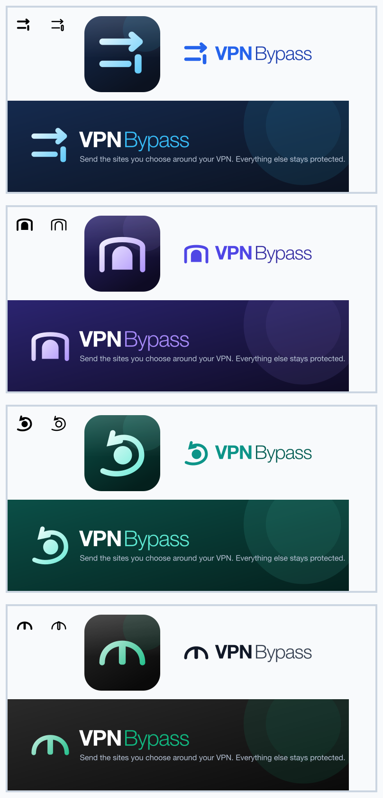
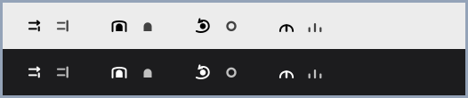
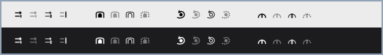
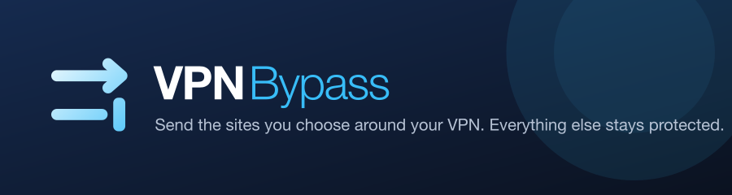
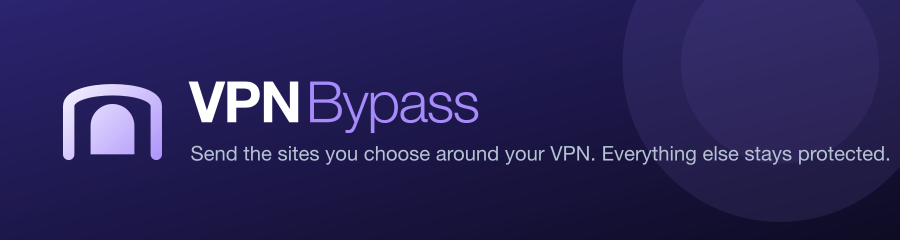
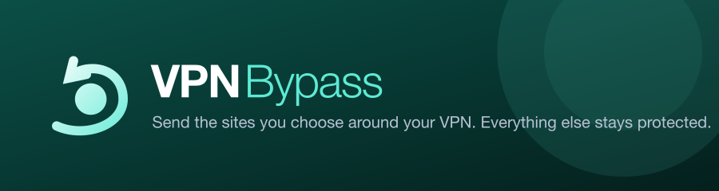
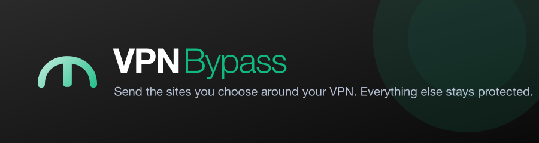

# Visual identity — four directions

> **DECIDED (2026-08-07): direction 1, "Lanes".** Electric blue `#2563EB` on deep navy, with
> the sky accent `#38BDF8` from the mark's arrow. Shipped across the menu bar states, app icon,
> in-app wordmark and banner. The other three are kept below as the record of what was
> considered and why.

Pick **one direction**. Each one is a complete, unified system: the same mark drives the menu
bar glyph, the app icon, the wordmark and the banner, so nothing drifts. Every asset here is
generated from a single source (`generate.py`), which is what guarantees they stay consistent.

---

## All four, every surface

Each block shows, left to right: **menu bar (active)** · **menu bar (idle)** · **app icon** ·
**wordmark** — then the **banner** underneath.

---

## The decision that matters most: the menu bar at real size

An 18-pixel glyph is where most icons fall apart, so judge here first. Actual size, on a light
and a dark menu bar — **active** then **idle** for each direction:

### How idle is shown (revised)

The first attempt made idle a hollow outline of the same mark. At 18px that was **not
distinguishable from active** — you could not tell whether the app was routing without
comparing the two side by side, which you never get to do in a real menu bar.

So idle is now a **different silhouette, not a lighter one**: the obstacle stays, the traffic
disappears. Lanes loses its arrow and stops at the wall; Tunnel loses the line going over it;
Orbit's swoosh drops to a bare ring; Arch's span collapses to its feet. A small dim is applied
on top, but the shape alone carries the state — no comparison required.

Three treatments were built and tested at true size before choosing (active, dimmed, hollow,
dashed — left to right per direction):

Dashed fragments turned to mush and hollow read as active; only a real silhouette change worked.

---

## No more ON / OFF badges

The old menu bar showed a route count and the dropdown showed an **ON/OFF** pill. Both are gone
in these proposals:

- **The count is removed.** It moved with DNS churn rather than with anything you did, so at a
  glance it was noise.
- **State is the same mark, whole or reduced.** Complete mark = actively routing. Reduced mark
  (obstacle only, traffic gone) = idle or no VPN. Same family, no badge, and legible at 18px
  without comparing against anything.
- A problem (helper down, nothing being enforced) is the only case that changes anything more,
  and it is stated in words in the dropdown rather than encoded in a glyph.

---

## The four directions

### 1. Lanes — precise, technical, unmistakable

Two routes leave together. One passes straight through with an arrow; the other stops at a wall.
It is the literal picture of what the app does, and it is the easiest of the four to read
instantly at any size.

**Palette:** electric blue `#2563EB` on deep navy. **Feels like:** a precision network tool.

### 2. Tunnel — the strongest silhouette

The solid arch is the VPN tunnel; the line vaults over the top of it instead of going through.
The heaviest, most distinctive shape of the four — the clearest at 18px, and the one most likely
to be recognised at a glance in a crowded menu bar.

**Palette:** indigo `#4F46E5` into violet. **Feels like:** infrastructure, something solid.

### 3. Orbit — dynamic and modern

Traffic slingshots around the network core rather than being pulled through it. The most
energetic of the four and the most "brand-like" rather than diagrammatic.

**Palette:** teal `#0D9488` with mint. **Feels like:** modern, fast, a bit playful.

### 4. Arch — the minimalist

A single clean vault over a barrier. The most restrained option: nearly monochrome, with one
signal-green accent.

**Palette:** graphite with signal green `#10B981`. **Feels like:** understated, developer-tool.

---

## Why Lanes was chosen (recommendation at the time)

**Tunnel** if you want the icon to be unmistakable at a glance — it has the most presence at
18px and the arch is the most ownable shape here.

**Lanes** if you would rather the icon *explain itself* — it is the most literal depiction of
"one route goes through, one goes around", and blue reads as a networking tool.

Orbit is the best-looking at large sizes but slightly the busiest small. Arch is the most
tasteful and the least memorable — it reads as a letterform before it reads as a mark.

---

## What happens after you choose

The chosen direction replaces, in one change: the menu bar glyphs (all states), `AppIcon.icns`
at every required resolution, the in-app wordmark, the README banner, and the Docker/GitHub
social preview. Nothing else needs touching, because everything derives from the one mark.
