# UI and UX proposals: menu bar dropdown and Settings window

These are proposals. Where they stand:

- **1, 3, 4 and 5** are built and merged (#127, #125, #124, #126).
- **2D and 6A** are the picked alternatives for 2 and 6.
- **7 to 16** are all approved.

Everything still to build is being built, each in its own PR.

The list is ranked by what each problem costs the person using the app. A wrong click that changes how the whole Mac routes traffic ranks above a label that reads oddly. Every claim points at the code as of `main` at [`ddd1cb0`](https://github.com/GeiserX/VPN-Bypass/commit/ddd1cb0). The "before" halves of the images are crops of the real screenshots in [`docs/images/screenshots/` at `ddd1cb0`](https://github.com/GeiserX/VPN-Bypass/tree/ddd1cb0/docs/images/screenshots), or redrawn from the code where no screenshot shows that view. Each image says which. The mockups crop copies of those screenshots kept in [`proposals/ui/before/`](proposals/ui/before/), so a re-render gives the same crops after the screenshots in `docs/images/screenshots/` change. The "after" halves are HTML mockups in [`proposals/ui/`](proposals/ui/) that reuse the colours and type from [`Theme.swift`](../../Sources/VPNBypassCore/Theme.swift). Re-render them with [`proposals/ui/render.sh`](proposals/ui/render.sh), one file at a time, then run `pngquant --quality 80-95` over the PNG. Several come out of `render.sh` over 400 KB.

Sizes are rough. S is an afternoon and one or two files. M is a day or two and some new state in `RouteManager`. L is a redesign of a whole surface.

Logo and icon work is a separate lane, in [`IDENTITY-PROPOSALS.md`](IDENTITY-PROPOSALS.md). Nothing here touches it.

## 1. One status sentence that says what the app is doing

**Built and merged in [#127](https://github.com/GeiserX/VPN-Bypass/pull/127).**

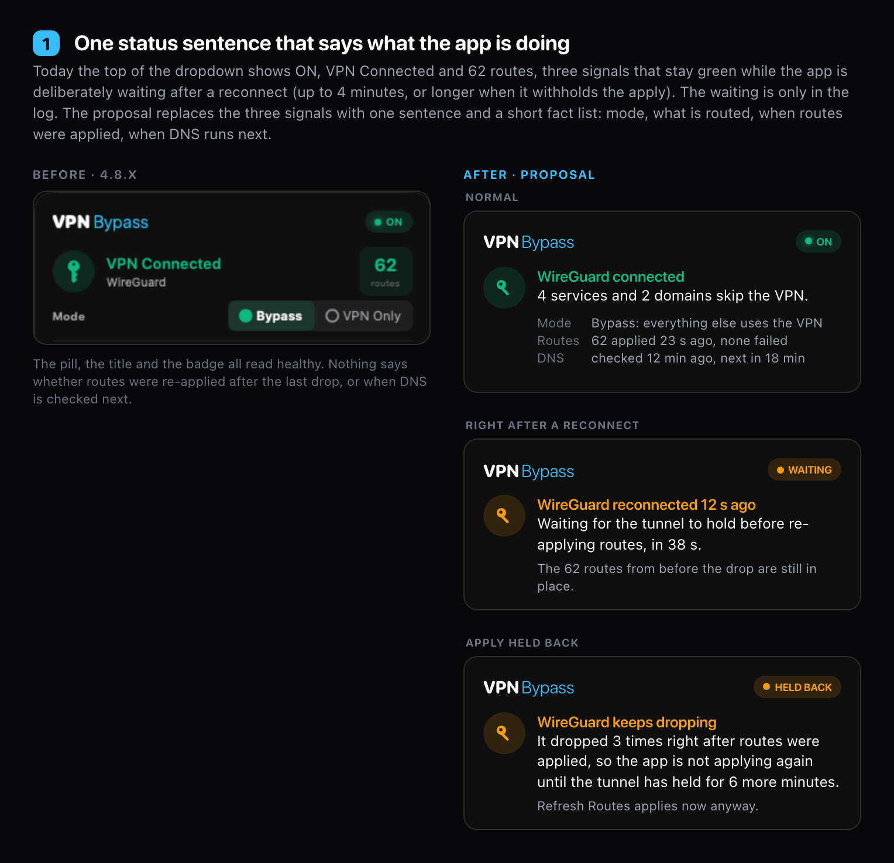

**What the user sees.** The top of the dropdown shows three signals: a green ON pill, a green "VPN Connected" title and a "62 routes" badge. The Active Routes card further down repeats the 62.

**Where.** `titleHeader` and `statusPill` in `MenuBarViews.swift:233-277`, `headerSection` in `MenuBarViews.swift:334-387`, the footer's "Updated … ago" in `MenuBarViews.swift:879-909`.

**What it costs.** After a reconnect the app waits on purpose before re-applying routes. The wait starts at 10 or 20 s and doubles up to 240 s when the tunnel keeps dropping right after an apply. Past a threshold the app withholds the apply for minutes (`RouteManager.swift:770-795`, `RerouteDecider.swift:101-125`). All of that is only in the log. The dropdown stays green, because the routes from before the drop are kept. A user who just reconnected cannot tell whether the app is done, waiting, or has given up for a while. "Updated 23 sec ago" does not say what was updated, and the DNS refresh schedule lives in Settings > General.

**Proposal.** Replace the three signals with one line that says who is connected, one sentence that says what is routed, and three short facts: mode, when routes were applied and whether any failed, when DNS was checked and when it runs next. Add two states the app has today but never shows: WAITING, with the countdown, and HELD BACK, with the reason and the time left. Say that Refresh Routes applies right away, which it does, because `detectAndApplyRoutesAsync` does not check the strike counter. The "62 routes" badge goes away. The count moves into the facts.

**Size.** M. `MenuBarViews.swift`, and `RouteManager.swift` to publish the settle deadline, the withheld-until time and the last apply result. Today those are private.

## 2. The routing mode stops looking like a tab

**Picked: 2D, the mode as a menu in the window toolbar.** The first draft is kept at [`02-mode-is-not-a-tab.png`](proposals/ui/02-mode-is-not-a-tab.png). Its sheet stays. The four alternatives replace its Change… button.

**What the user sees.** Two rows of green pills at the top of Settings. The top row (Bypass, VPN Only, Custom Routes) and the row under it (Domains, Services, General, Logs, Info) share one style: the same gradient, the same glow, the same size.

**Where.** `RoutingModePicker` and `RoutingModeSegment` in `SettingsView.swift:471-588`, `TabItem` in `SettingsView.swift:143-191`, both placed by `headerView` in `SettingsView.swift:85-121`.

**What it costs.** The top row changes how all of the Mac's traffic is routed. The second row only changes the page. A user who wants to look at their VPN Only list clicks VPN Only, as they would click a tab, and gets an alert asking to switch the whole machine. The alert saves them, but the only way to see or edit the other mode's list is still to switch modes.

**Proposal.** Navigation moves into a native toolbar, icon above label, with a plain highlight on the selected page, as in macOS System Settings. The mode becomes a setting of its own. What changes between the alternatives is the control that shows the mode and starts a switch. In all four, picking another mode opens the sheet with that mode already selected, the sheet lists the three modes as radio buttons with a one-line explanation and the size of each list, and nothing changes until Switch. The control keeps showing the current mode until then. A later step, not in the images: let the Domains page show the inactive mode's list read-only under a heading such as "Used in VPN Only mode".

### 2A. A segmented control in a "Routing mode" group

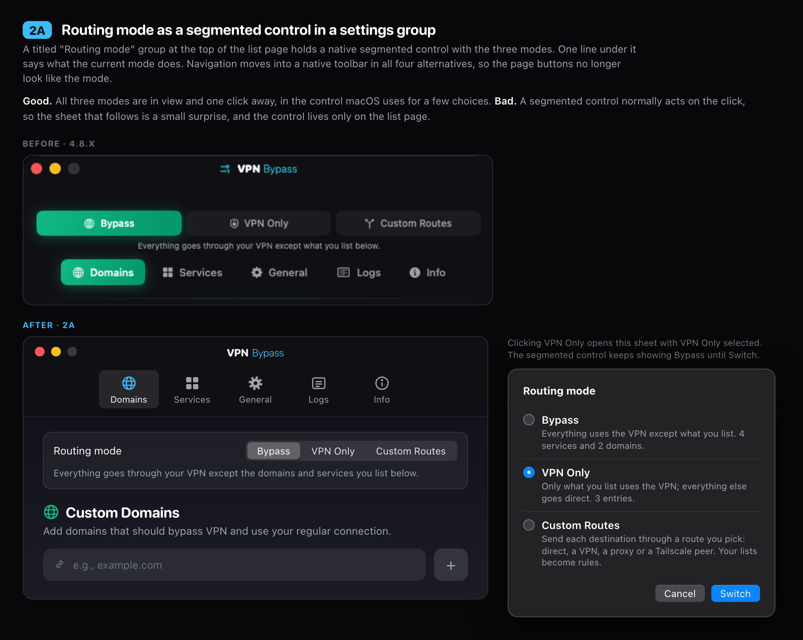

A native segmented control with the three modes, and one line under it saying what the current mode does. **Trade-off.** All three modes are in view and one click away, but a segmented control normally acts on the click, so the sheet that follows is a small surprise. It matches the dropdown's control if proposal 12 is picked.

### 2B. A popup button with a description per mode (recommended)

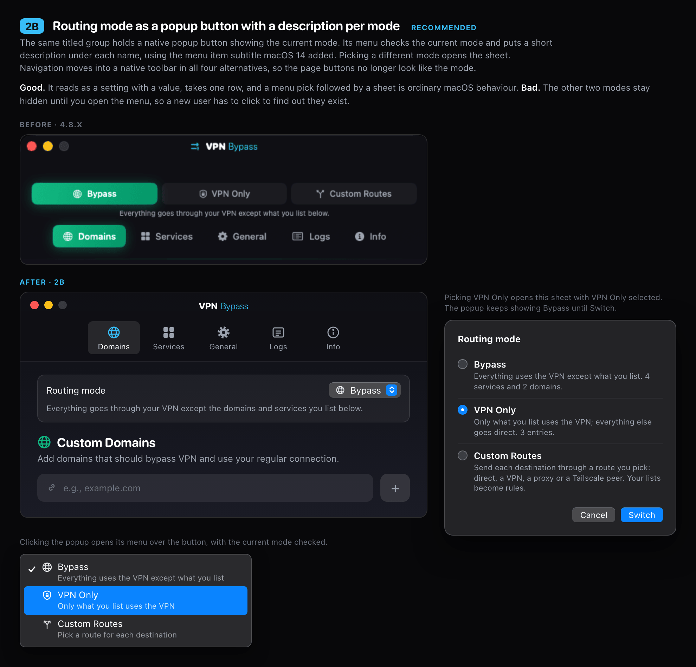

A native popup button showing the current mode. Its menu checks the current mode and puts a short description under each name. **Trade-off.** It reads as a setting with a value, takes one row, and a menu pick followed by a sheet is ordinary macOS behaviour, but the other two modes stay hidden until the menu opens. The descriptions use `NSMenuItem.subtitle`, which needs macOS 14. The app targets macOS 13 (`Package.swift`), so on 13 the menu shows the names only.

### 2C. Three radio cards with a diagram each

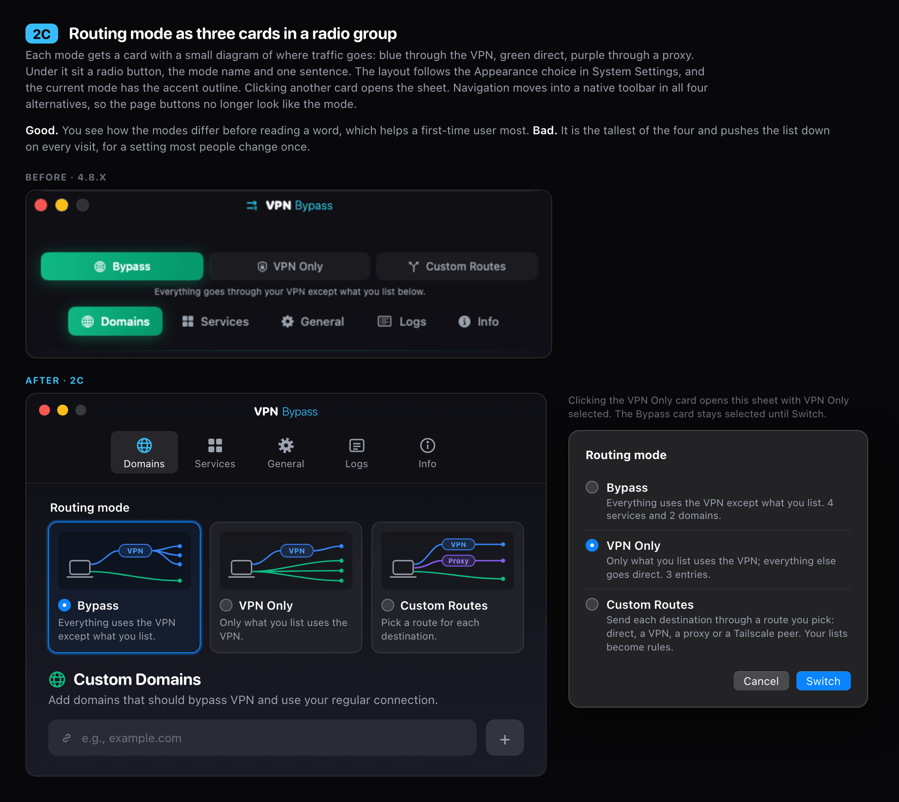

One card per mode with a small diagram of where traffic goes and one sentence, laid out like the Appearance choice in System Settings. **Trade-off.** The clearest for a first-time user, but the tallest of the four, and it pushes the list down on every visit for a setting most people change once.

### 2D. A mode menu in the title bar

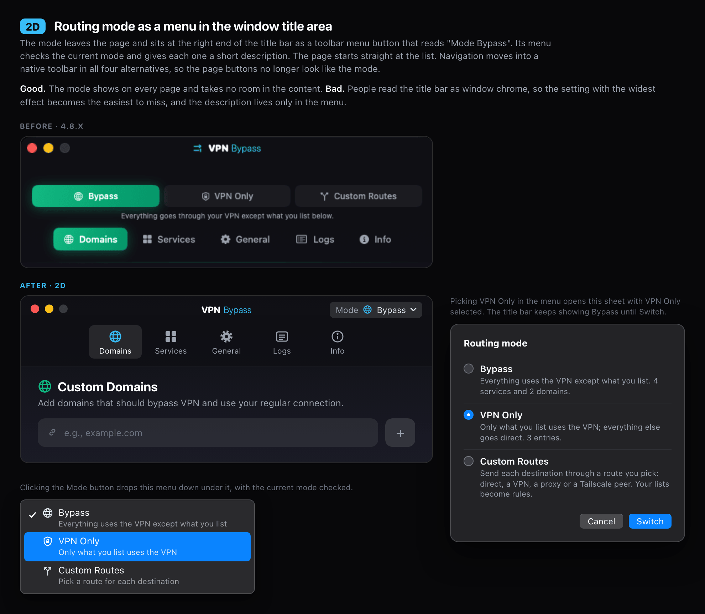

A "Mode Bypass" menu button at the right end of the title bar, with the same menu as 2B. **Trade-off.** Visible on every page and it takes no room in the content, but people read the title bar as window chrome, so the setting with the widest effect becomes the easiest to miss.

**Recommendation: 2B.** It reads as a setting, takes one row, and the sheet does the explaining. 2A is the runner-up if all three modes should be visible without a click, and it is the one that matches proposal 12's segmented control in the dropdown.

**Size.** M for any of the four. `SettingsView.swift` (header, mode picker, tab item). 2C adds three small drawings. `MenuBarViews.swift` keeps its own mode switch, see proposal 12.

## 3. Clear moves behind a menu, and Refresh says what it did

**Built and merged in [#125](https://github.com/GeiserX/VPN-Bypass/pull/125).**

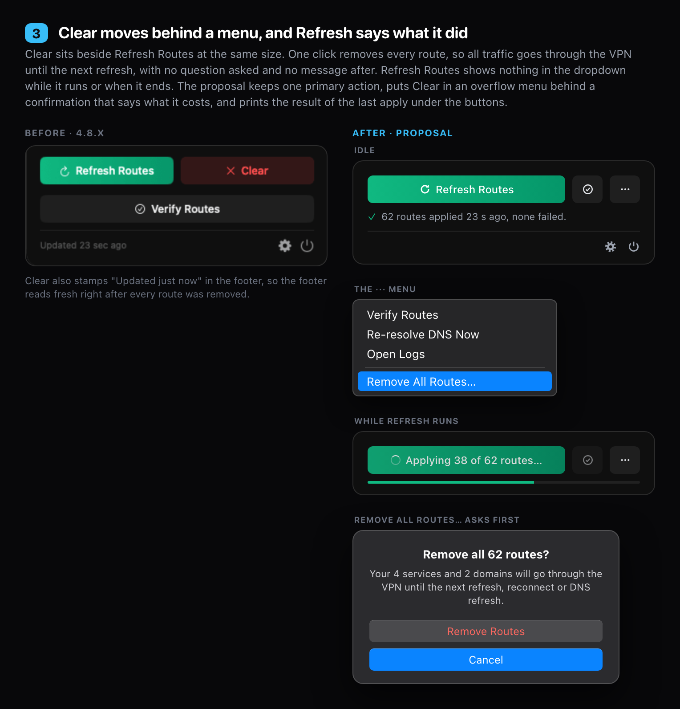

**What the user sees.** Refresh Routes and Clear side by side at the same size, with Verify Routes under them.

**Where.** `MenuBarViews.swift:465-531`. Clear calls `removeAllRoutes()` directly, at `MenuBarViews.swift:483-500`.

**What it costs.** One click on Clear removes every route. Until the next refresh, reconnect or DNS refresh, the bypassed services go through the VPN. Clear asks no question, and afterwards the dropdown shows no message. `removeAllRoutes` also sets `lastUpdate = Date()` (`RouteManager.swift:2426`), so the footer reads "Updated 0 sec ago" right after everything was removed. Refresh Routes, the most prominent button, gives no feedback in the dropdown while it runs or when it ends. The only signs are the menu bar icon pulsing and a system notification.

**Proposal.** One primary button, Refresh Routes, with Verify as a small icon button next to it and a "···" menu holding Verify Routes, Re-resolve DNS Now, Open Logs and Remove All Routes…. Remove All Routes… asks first, and the question says what it costs in this user's terms: "Your 4 services and 2 domains will go through the VPN until the next refresh, reconnect or DNS refresh." Cancel is the default button. Under the buttons, one line with the result of the last apply: "62 routes applied 23 s ago, none failed." While Refresh runs, the button shows a spinner. If the apply batch can report progress it shows a count too. Without a count the button just says "Applying routes…".

**Size.** S for the menu, the confirmation and the result line. M if the apply reports progress. `MenuBarViews.swift`, `RouteManager.swift` (a last-apply result struct, and `lastUpdate` left alone on Clear).

## 4. Proxy rules say which apps they reach, and the port reads right

**Built and merged in [#124](https://github.com/GeiserX/VPN-Bypass/pull/124).**

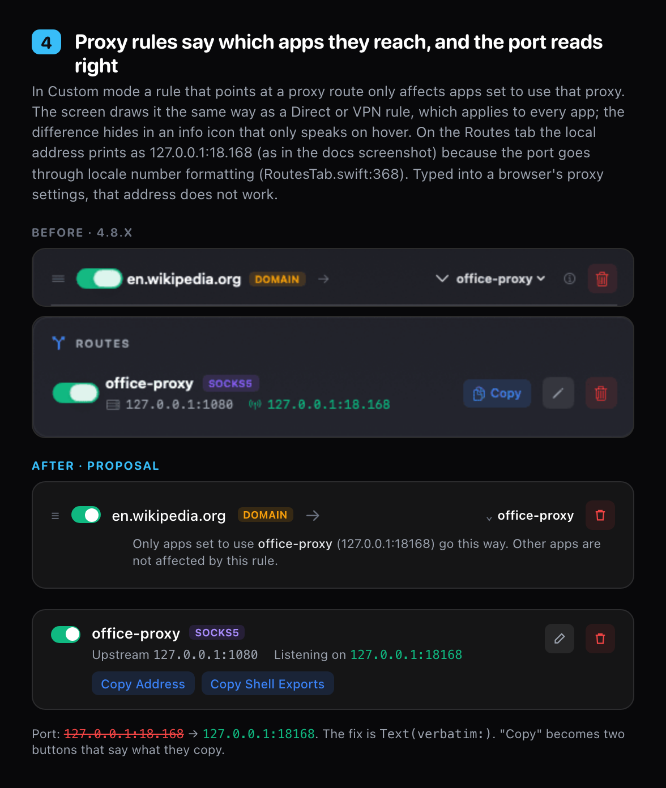

**What the user sees.** On the Rules page, `en.wikipedia.org → office-proxy` looks the same as `Telegram → Direct`. A small info icon sits after the proxy rule. On the Routes page, the proxy row shows its local address as `127.0.0.1:18.168`, next to a button labelled Copy.

**Where.** `RuleRow` in `RulesTab.swift:365-430`, where the only hint is `.help(...)` on the info icon at `RulesTab.swift:414-419`. `RouteRow` in `RoutesTab.swift:323-449`. The port is `Text("127.0.0.1:\(port)")` at `RoutesTab.swift:368`.

**What it costs.** A Direct or VPN rule changes the kernel routing table, so it applies to every app. A proxy rule emits no kernel route (`RouteCompiler.swift:12-19`). It only affects apps set to use that proxy's local address. The difference lives in a tooltip that shows on hover only, so a user who sets up a proxy rule and opens a browser sees nothing change and cannot tell why. The port goes through `LocalizedStringKey` interpolation, which formats the integer for the locale, so the docs screenshot shows `18.168`. Typed into a browser's proxy settings, that address fails. The upstream address on the same row is built as a `String` and prints right, `127.0.0.1:1080`. The Copy button copies shell `export` lines, not the address its label sits next to.

**Proposal.** Under every rule that points at a proxy or Tailscale-peer route, one line of plain text: "Only apps set to use office-proxy (127.0.0.1:18168) go this way. Other apps are not affected by this rule." It replaces the hover icon. Print the port with `Text(verbatim:)`. Split Copy into Copy Address and Copy Shell Exports.

**Size.** S. `RulesTab.swift`, `RoutesTab.swift`. The port fix is one line and could ship on its own as a `fix:`.

## 5. Adding a domain says what happened

**Built and merged in [#126](https://github.com/GeiserX/VPN-Bypass/pull/126).**

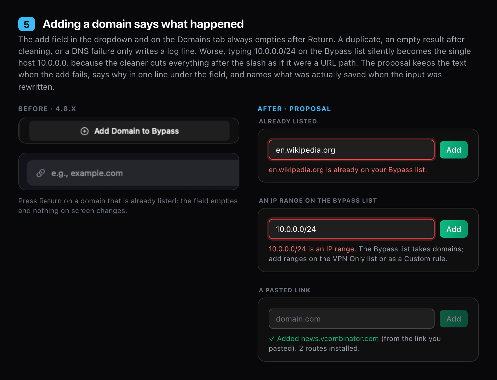

**What the user sees.** The add field in the dropdown and on the Domains page empties after Return, whatever happened.

**Where.** `addDomainAndClose` in `MenuBarViews.swift:918-929`, `DomainsTab.addDomain` in `SettingsView.swift:380-388`, `RouteManager.addDomain` in `RouteManager.swift:3517-3552`, `addInverseDomain` in `RouteManager.swift:3952-3972`, `cleanDomain` in `RouteManager.swift:5120-5150`.

**What it costs.** A duplicate only logs "already exists" and returns (`RouteManager.swift:3521-3523`). An input that cleans down to nothing returns without a word. A malformed range on the VPN Only list logs "Invalid CIDR notation". In all three cases the field empties, so the user believes the add worked. One case is worse. On the Bypass list, `cleanDomain` cuts everything after a `/` as if it were a URL path, so `10.0.0.0/24` is saved as the single host `10.0.0.0`. The list then shows an entry the user never typed, and 255 of the 256 addresses they meant still go through the VPN. The 4.9.0 socket verb `domain.add` rejects a `/` on the bypass list with `invalid_args`. The GUI should match it.

**Proposal.** `addDomain` and `addInverseDomain` return a result instead of logging and returning. On failure the field keeps the text, gets a red outline, and one line under it says why in the user's words. On success, one green line names what was saved when the input was rewritten ("Added news.ycombinator.com, from the link you pasted") and how many routes went in. An IP range on the Bypass list is refused and the message says where ranges go.

**Size.** S to M. `RouteManager.swift` (return a result from both add functions), `MenuBarViews.swift`, `SettingsView.swift`. The control socket lane can reuse the same result for its error codes.

## 6. A first run that asks one question

**Picked: 6A.** The first draft is kept at [`06-guided-first-run.png`](proposals/ui/06-guided-first-run.png). Its question stays. The four alternatives replace its tinted blue box.

**What the user sees.** After the admin password prompt, an amber NO ROUTES pill and the line "Nothing configured yet, add a domain below or enable a service in Settings to start bypassing."

**Where.** `nothingConfiguredHint` in `MenuBarViews.swift:282-301`, `statusPill` in `MenuBarViews.swift:266-277`.

**What it costs.** The app is honest about routing nothing, which is good, but amber reads as a fault on a fresh install. The hint sends the user to Settings with no button to get there. The dropdown cannot enable a service, so the first real step takes a trip through the gear icon, a tab and a 37-row list.

**Proposal.** A neutral NOT SET UP pill instead of the amber NO ROUTES, and the question "What should skip the VPN?" asked on a fresh install, with a way to add a single site and a line that offers VPN Only for users who want the opposite. The first draft put it in a tinted, blue-bordered box, the only one of its kind in a grey dropdown. The four alternatives change how the question is laid out and where it is asked.

### 6A. A grouped list with the Services page's own switches (recommended)

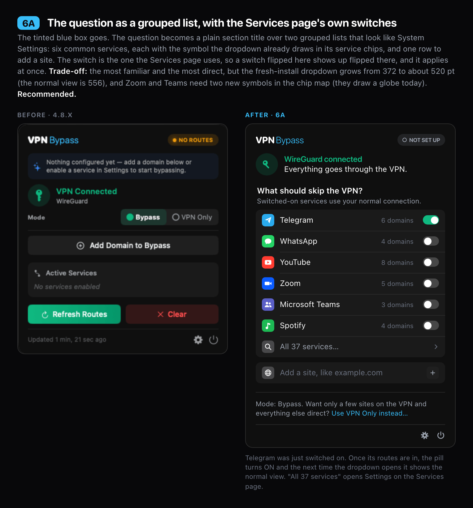

The question becomes a plain section title over a grouped list in the System Settings style: six common services with the symbols the dropdown's service chips already use (`ServiceChip.iconName`, `MenuBarViews.swift:996`), the same switch as the Services page, a row for all 37 services and a row to add a site. Each switch applies at once. **Trade-off.** The most familiar and the most direct, but the fresh-install dropdown grows from 372 to about 520 pt (the normal view is 556), and Zoom and Teams need two new symbols in the chip map (they draw a globe today).

### 6B. A compact step card with one button to start

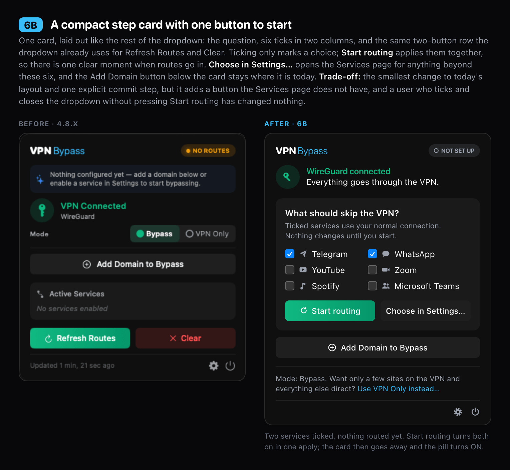

One card with the question, six ticks in two columns, and the dropdown's own two-button row with Start routing and Choose in Settings…. **Trade-off.** The smallest change to today's layout, with one clear moment when routes go in, but ticks do nothing until the button is pressed, and a user who closes the dropdown first has changed nothing.

### 6C. A welcome window, like the macOS setup assistants

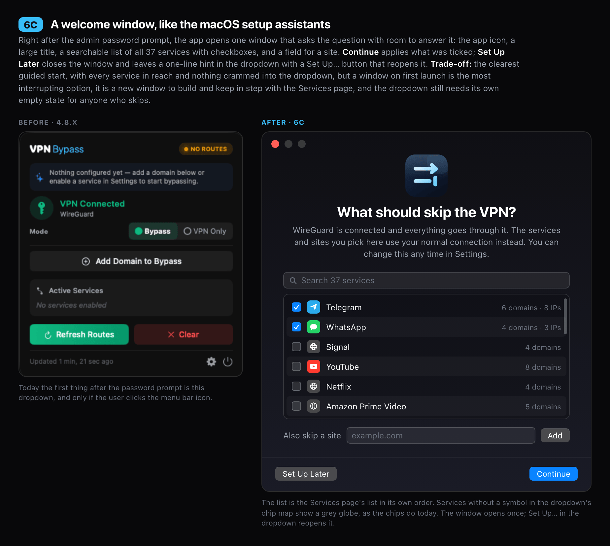

Right after the admin password prompt, one window with the app icon, a large title, a searchable list of all 37 services with checkboxes, a site field, and Set Up Later / Continue. **Trade-off.** The clearest guided start, with every service in reach, but the most interrupting option, a new window to build and keep in step with the Services page, and the dropdown still needs an empty state for anyone who skips.

### 6D. A two-line empty state that opens into the picker

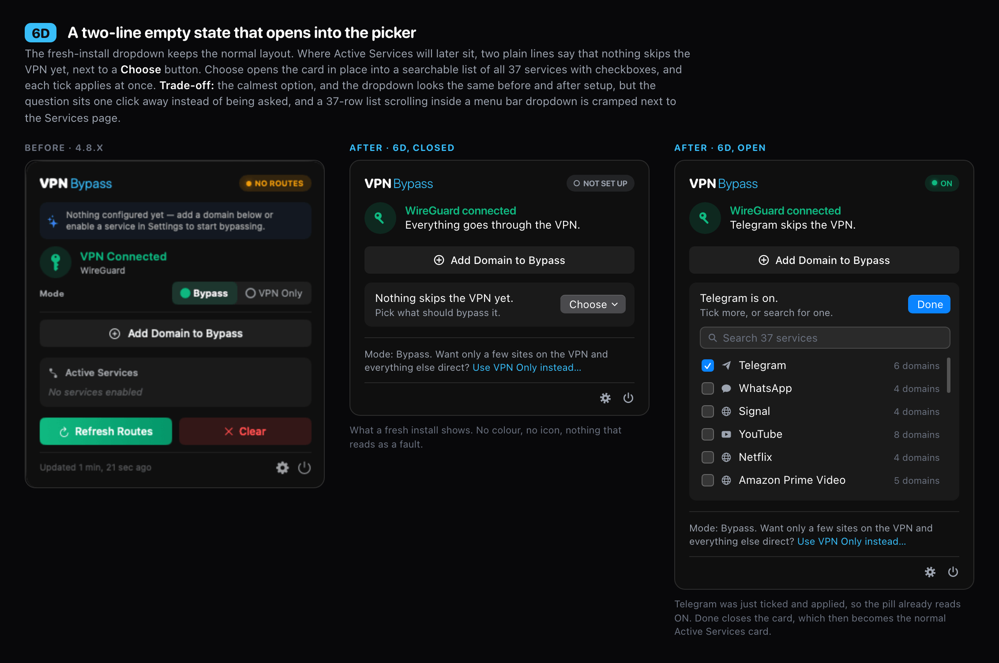

The dropdown keeps its normal layout. Where Active Services will later sit, two plain lines say nothing skips the VPN yet, next to a Choose button that opens the card in place into a searchable list. Shown closed and open. **Trade-off.** The calmest option, but the question is one click away instead of being asked, and a 37-row list scrolling inside a menu bar dropdown is cramped.

**Recommendation: 6A.** It keeps the question in the dropdown, and each choice still applies at once. It drops the tinted box for the grouped-list look and switches the Services page already has. 6C is the runner-up if a separate welcome window is preferred.

**Size.** M for 6A, 6B and 6D, in `MenuBarViews.swift`. The services come from the existing `config.services`, so no new data. L for 6C, which needs a new window as well as the dropdown's empty state.

## 7. Group what is routed by what the user added

**Approved.**

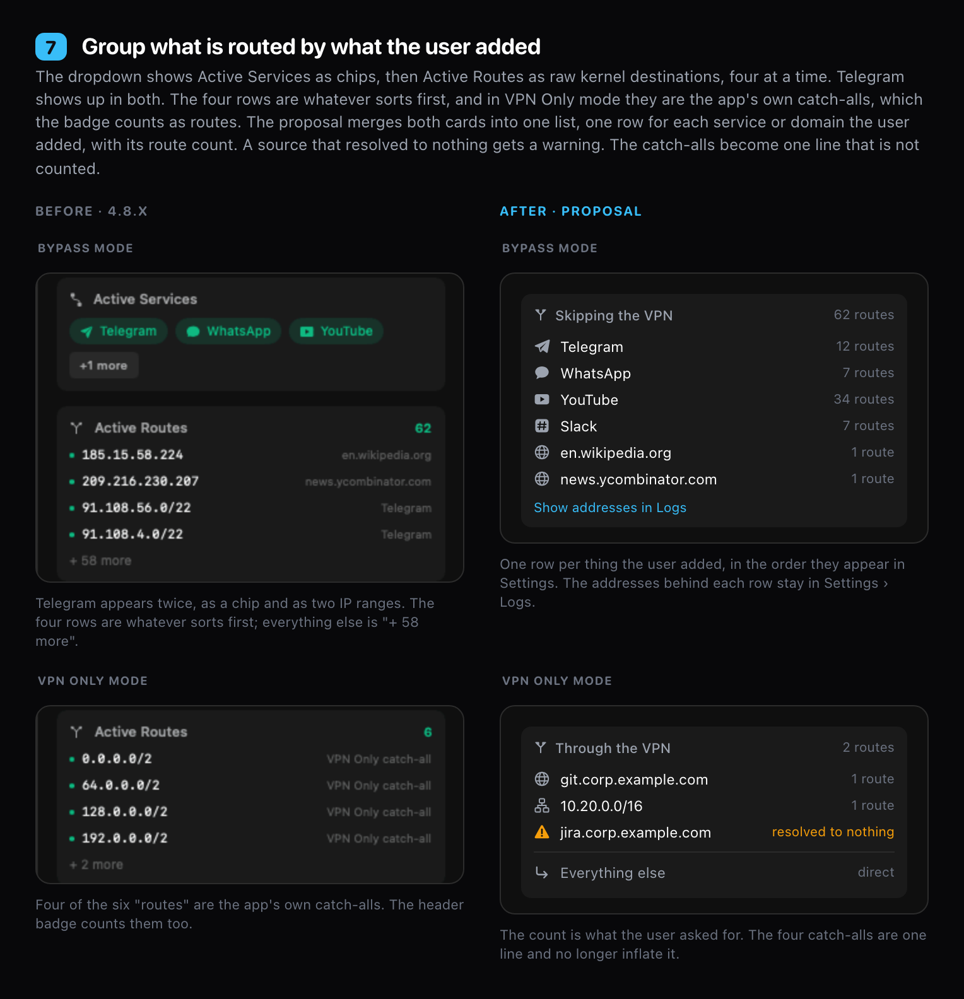

**What the user sees.** Active Routes lists raw kernel destinations such as `91.108.56.0/22 Telegram`, four at a time, and "+ 58 more". In VPN Only mode four of the six are `0.0.0.0/2 … VPN Only catch-all`, and the header badge counts them as routes.

**Where.** `recentRoutesSection` in `MenuBarViews.swift:710-750`, `activeServicesSummary` in `MenuBarViews.swift:606-649`, `uniqueRouteCount` in `RouteManager.swift:22`.

**What it costs.** Users add services and domains, not IP ranges, so the list answers a question they did not ask. The first four rows are whatever happens to sort first. Telegram appears twice, as a chip in Active Services and again as two IP rows. In VPN Only mode "6 routes" is mostly the app's own catch-alls.

**Proposal.** Merge Active Services and Active Routes into one list keyed by source: "Telegram, 8 routes", "en.wikipedia.org, 1 route", with a warning mark on a source that resolved to nothing. The VPN Only catch-alls become one line, "Everything else: direct", and drop out of the count. Raw destinations stay one click away in Settings > Logs.

**Note.** Where the screenshot shows nothing, the image makes up example data. That covers Slack as the fourth enabled service, the per-source counts that add up to 62, and the corp.example.com entries on the VPN Only list.

**Size.** M. `MenuBarViews.swift`.

## 8. Deletes and All/None act at once, with no undo

**Approved.**

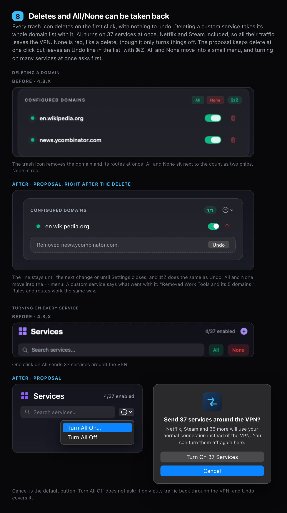

**What the user sees.** A trash icon on every domain, custom service, rule and route. All and None buttons above the domain list and the service list.

**Where.** `DomainRow` trash at `SettingsView.swift:441-453`, domain All/None at `SettingsView.swift:300-328`, service All/None at `SettingsView.swift:730-755`, custom service trash at `SettingsView.swift:871-880`, route trash at `RoutesTab.swift:434-444`, `deleteRule` at `RulesTab.swift:279-282`.

**What it costs.** Every one of these acts on the first click, with nothing to undo. Deleting a custom service deletes its whole domain list. Services All turns on 37 services, Netflix and Steam included, so all their traffic leaves the VPN. None is styled red, like a delete, though it only disables.

**Proposal.** Deletes stay one click but leave an undo line ("Removed en.wikipedia.org. Undo") and support ⌘Z. All and None move into a small menu. Enabling more than a handful of services at once asks first: "Send 37 services around the VPN?".

**Note.** The image keeps today's switch style so it shows only this change. If 8 and 9 are both picked, the Services page changes in both places.

**Size.** M. `SettingsView.swift`, `RoutesTab.swift`, `RulesTab.swift`, and an undo stack in `RouteManager.swift` or the SwiftUI `UndoManager`.

## 9. Switches without names, and no keyboard shortcuts

**Approved.**

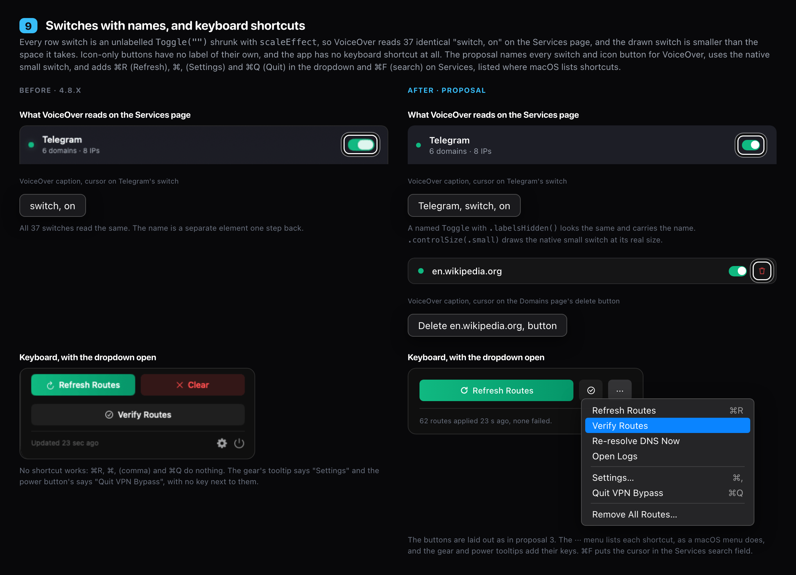

**What the user sees.** Row switches scaled down to between 70 and 80 percent. Icon-only buttons for settings, quit, edit and delete.

**Where.** `Toggle("", …)` at `SettingsView.swift:425`, `SettingsView.swift:884`, `SettingsView.swift:2114`, `RoutesTab.swift:326` and `RulesTab.swift:379`, each followed by a `.scaleEffect` of 0.7 to 0.8. The whole app has one `accessibilityLabel`, on the menu bar icon (`MenuBarViews.swift:98`), and no `keyboardShortcut` at all.

**What it costs.** VoiceOver reads each switch as "switch, on" with no name, so a list of 37 services is 37 identical switches. `scaleEffect` shrinks the drawing but not the layout, so the click target and the visible switch disagree. Nobody can refresh routes or open Settings from the keyboard. This also matters for anyone driving the app through accessibility tooling rather than the socket.

**Proposal.** `Toggle(service.name, isOn:).labelsHidden()` with `.controlSize(.small)` instead of `scaleEffect`. An `accessibilityLabel` on every icon-only button ("Delete en.wikipedia.org"). Shortcuts: ⌘R Refresh Routes, ⌘, Settings, ⌘Q Quit in the dropdown, ⌘F to search on the Services page.

**Size.** S. `SettingsView.swift`, `RoutesTab.swift`, `RulesTab.swift`, `MenuBarViews.swift`.

## 10. Verify Routes checks 10 addresses and the result reads like all of them

**Approved.**

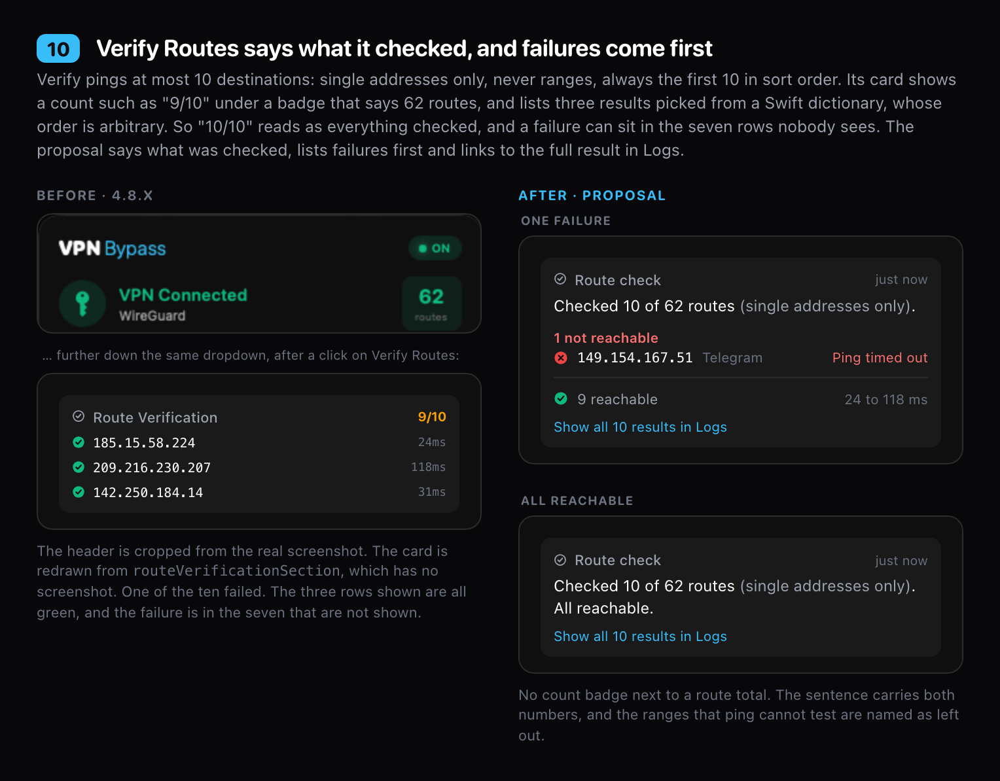

**What the user sees.** After Verify, a Route Verification card with a count such as "10/10", right under a badge that says 62 routes, listing three results.

**Where.** `verifyRoutes` in `RouteManager.swift:4368-4400`, `routeVerificationSection` in `MenuBarViews.swift:754-803`.

**What it costs.** Verify pings at most 10 destinations, only single addresses, never ranges, and always the first 10 in sort order. "10/10" next to "62 routes" reads as everything checked. The three rows shown come from `results.values.prefix(3)` on a Swift `Dictionary`, whose order is arbitrary, so a failure can sit in the seven rows nobody sees.

**Proposal.** Say the scope: "Checked 10 of 62 routes (single addresses only). All reachable." List failures first. Link to the Logs page for the full result.

**Note.** "Show all 10 results in Logs" needs Verify to log one line per result. Today it logs a summary line and sends a notification per failure (`RouteManager.swift:4368-4400`).

**Size.** S. `MenuBarViews.swift`.

## 11. Enabled services sit scattered in a list of 37

**Approved.**

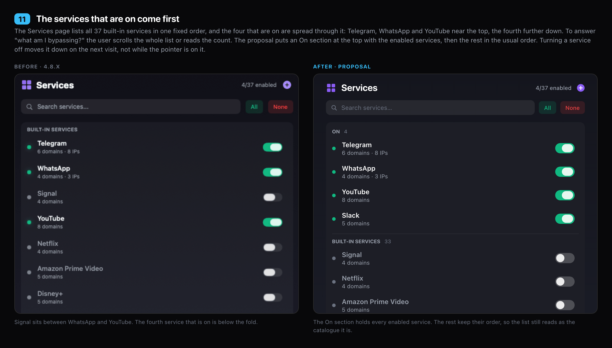

**What the user sees.** The Services page lists all built-in services in one fixed order. The four that are on are spread through it.

**Where.** `ServicesTab` in `SettingsView.swift:592-816`.

**What it costs.** To answer "what am I bypassing?" the user scrolls the whole list or reads the count in the header.

**Proposal.** An "On" section at the top with the enabled services, then the rest. Or a native segmented filter, On and All, next to the search field.

**Note.** The image keeps today's All/None chips so it shows only this change. Proposal 8 would move them into a menu.

**Size.** S. `SettingsView.swift`.

## 12. The dropdown's mode switch is hand-drawn and hides Custom

**Approved.**

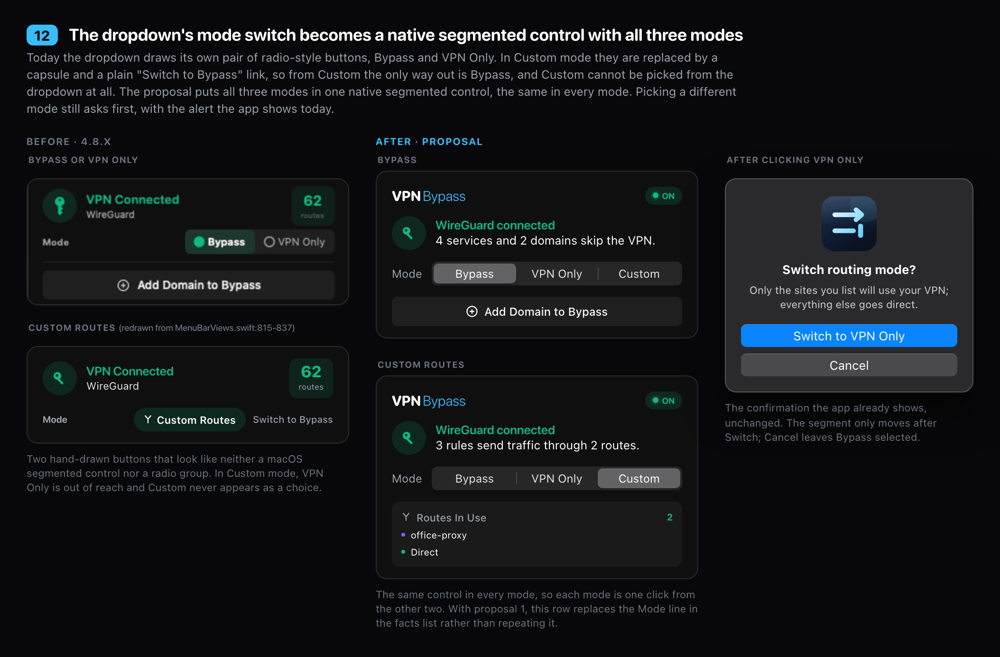

**What the user sees.** Two custom radio buttons, Bypass and VPN Only. In Custom mode: a "Custom Routes" capsule and a plain-text "Switch to Bypass" link.

**Where.** `routingModeToggle` and `modeButton` in `MenuBarViews.swift:807-875`.

**What it costs.** The control looks like neither a macOS segmented control nor a radio group. From Custom mode the only way out offered is Bypass, and Custom cannot be chosen from the dropdown at all.

**Proposal.** A native segmented `Picker` with all three modes, behind the same confirmation alert.

**Note.** If 2A is picked, the Settings window and the dropdown use the same segmented control.

**Size.** S. `MenuBarViews.swift`.

## 13. Live status is spread over three pages

**Approved.**

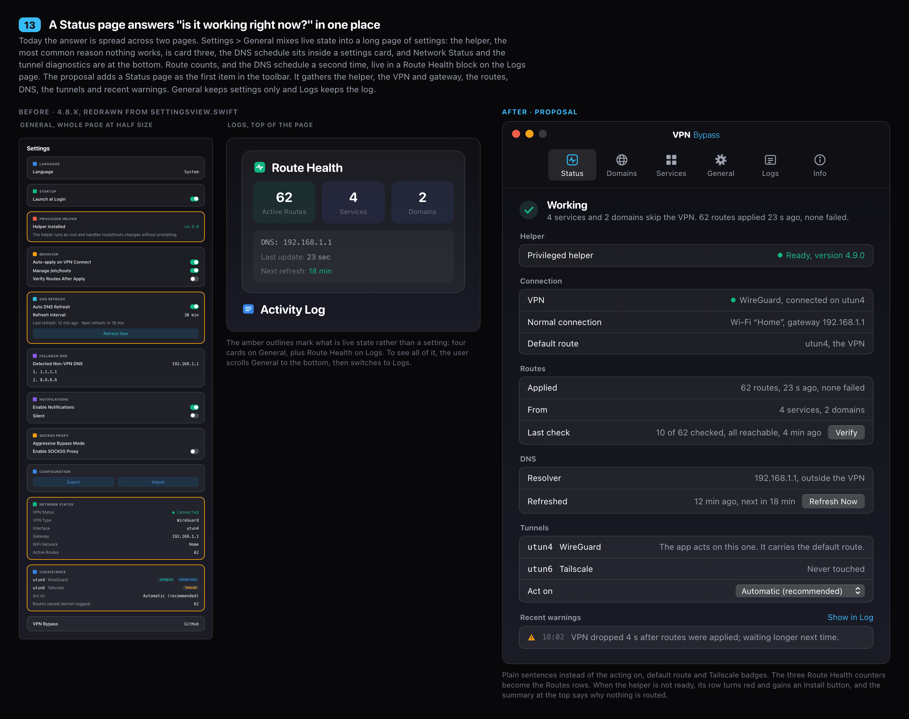

**What the user sees.** Settings > General has ten cards: Language, Startup, Privileged Helper, Behavior, DNS Refresh, Fallback DNS, Notifications, SOCKS5 Proxy, Configuration, Network Status, then the coexistence diagnostics. Settings > Logs opens with a separate Route Health block. Settings > Info shows the version again.

**Where.** `GeneralTab` in `SettingsView.swift:1137-2029` (Network Status at `SettingsView.swift:1857`, `CoexistenceCard` at `SettingsView.swift:1912`), `routeHealthSection` in `SettingsView.swift:2243-2344`.

**What it costs.** To answer "is it working right now?" the user scrolls to the bottom of a settings page, then opens Logs for route counts and the DNS schedule. The helper's state, the most common reason nothing works, is card three of ten on a page named General.

**Proposal.** A Status page: helper state, VPN and gateway, route health, last and next DNS refresh, coexistence diagnostics, recent warnings. General keeps settings only. Logs keeps the log.

**Note.** The image uses the toolbar from proposal 2, with Status added as the first page.

**Size.** M. `SettingsView.swift`, maybe split into a new `StatusTab.swift`.

## 14. The log has no filter

**Approved.**

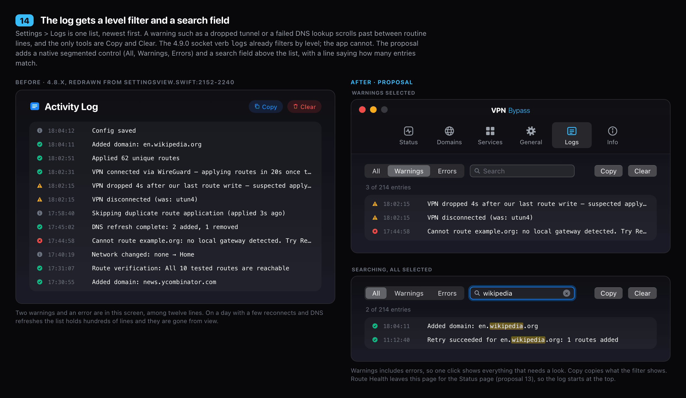

**What the user sees.** Settings > Logs is one list, newest first, with Copy and Clear.

**Where.** `LogsTab` in `SettingsView.swift:2152-2240`.

**What it costs.** A warning or an error scrolls past among routine INFO lines. The 4.9.0 socket verb `logs` already filters by `level`. The GUI cannot.

**Proposal.** A native segmented control, All, Warnings, Errors, and a search field.

**Note.** The image uses the toolbar from proposal 2, and Route Health moves to the Status page from proposal 13.

**Size.** S. `SettingsView.swift`.

## 15. Changes made through `vpnb` or an agent are invisible in the app

**Approved.**

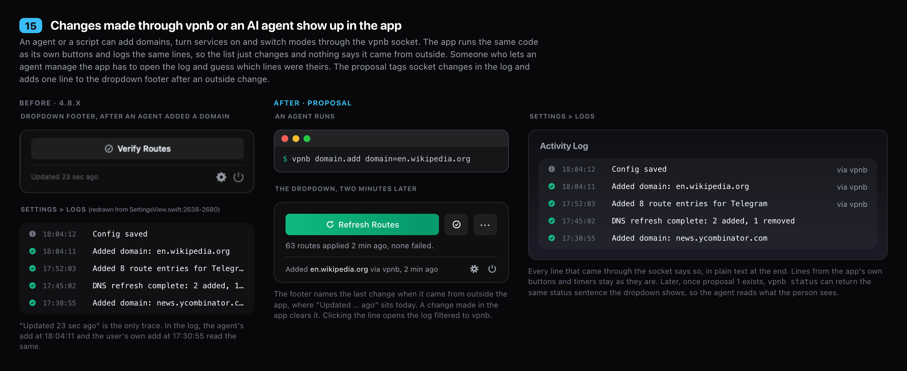

**What the user sees.** When a domain is added or a service turned on over the control socket, the list simply changes. Nothing says it came from outside.

**Where.** `CommandRouter.swift` and `ControlSocketServer.swift` call the same `RouteManager` methods the buttons call, which log the same lines. The dropdown footer in `MenuBarViews.swift:879-909`.

**What it costs.** Someone who controls the app through an AI agent needs to see what the agent did, and when, without opening the log. A person who shares a Mac with scripts cannot tell a script's change from their own.

**Proposal.** Tag log lines that came through the socket ("via vpnb"). Add one footer line in the dropdown after an outside change: "Last change: added en.wikipedia.org via vpnb, 2 min ago". Once proposal 1 exists, give `status` the same sentence the dropdown shows, so an agent reads what the human sees. That would be a new optional field on `result.runtime` in a later release, since the 4.9.0 wire contract is frozen.

**Size.** M. `CommandRouter.swift`, `RouteManager.swift` (a source on log entries), `MenuBarViews.swift`.

## 16. "Route" means three different things

**Approved.**

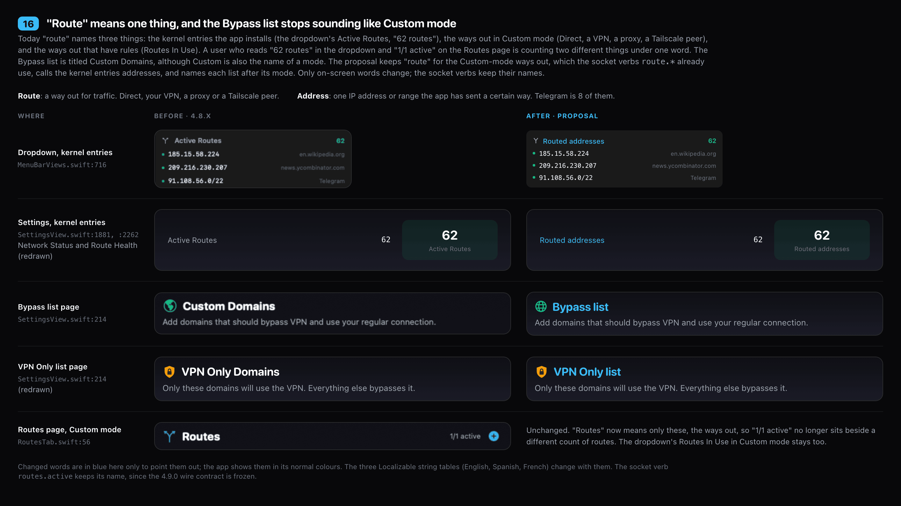

**What the user sees.** "Active Routes" in the dropdown (kernel entries), "Routes" in Custom mode (egresses: Direct, a VPN, a proxy, a Tailscale peer), and "Routes In Use" (egresses that have rules). The Bypass list is titled "Custom Domains", although Custom is also the name of a mode.

**Where.** `MenuBarViews.swift:651-656`, whose comment already works around the collision. `SettingsView.swift:214`.

**What it costs.** A user reading "62 routes" and "1/1 active" on the Routes page is counting two different things under one word. "Custom Domains" on the Bypass page suggests the list belongs to Custom mode.

**Proposal.** Keep "route" for the Custom-mode egresses, since the socket verbs `route.*` already use it that way. In user-facing copy, call kernel entries "addresses": "62 addresses routed". Retitle "Custom Domains" to "Bypass list" and "VPN Only Domains" to "VPN Only list". The socket verb `routes.active` keeps its name. Only the words on screen change.

**Note.** Proposals 1, 3, 7, 10 and 13 say "routes" in their images so each shows only its own change. If 16 is picked, those counts read "addresses" instead.

**Size.** S. `MenuBarViews.swift`, `SettingsView.swift`, the three `Localizable` string tables.
