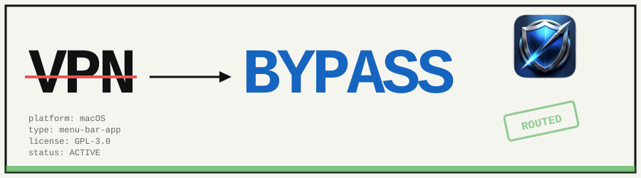
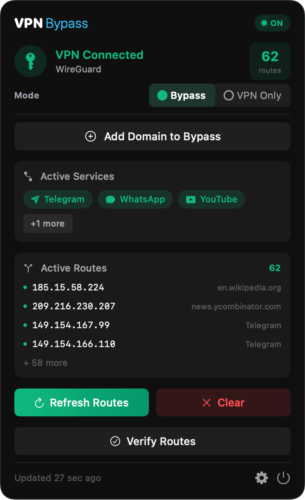
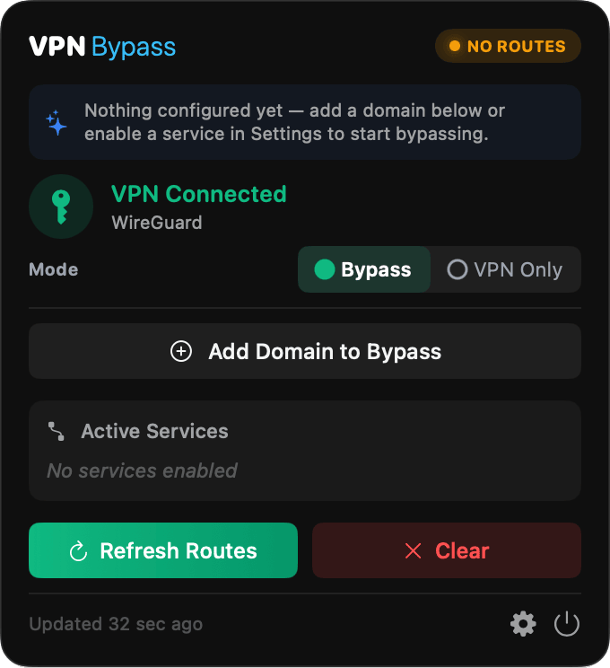
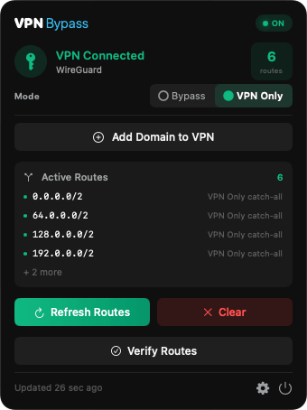
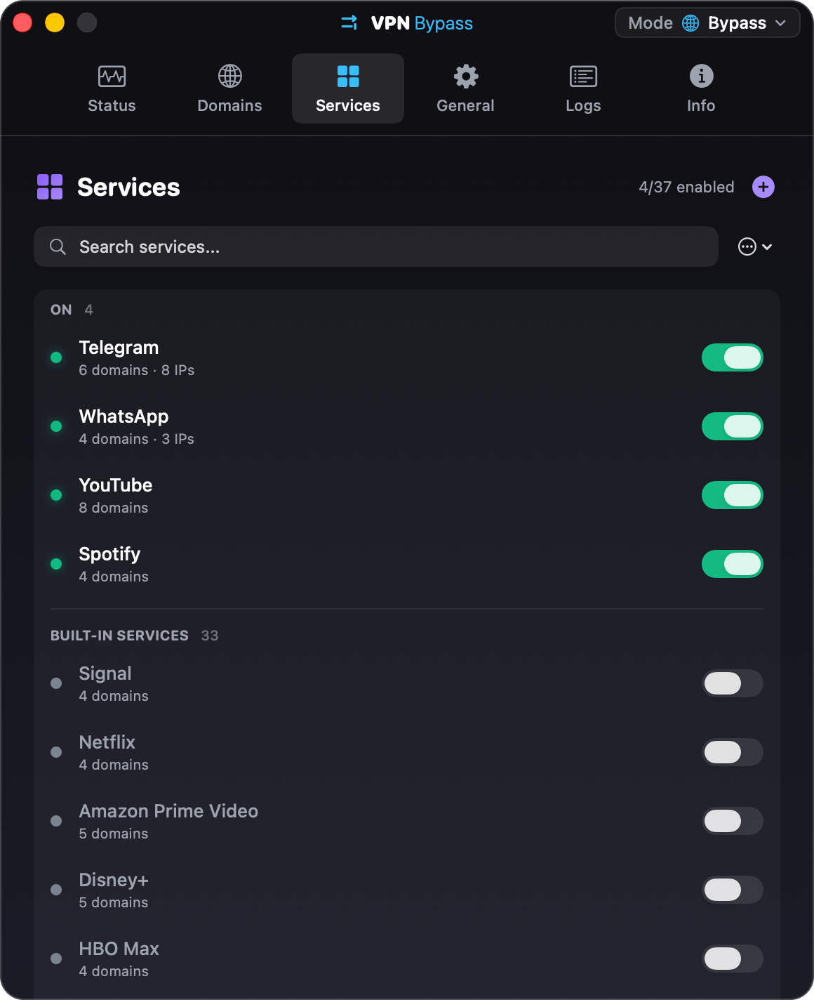
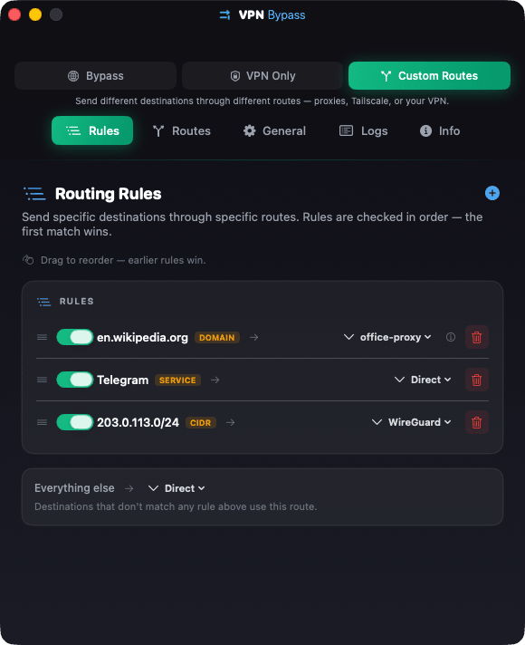
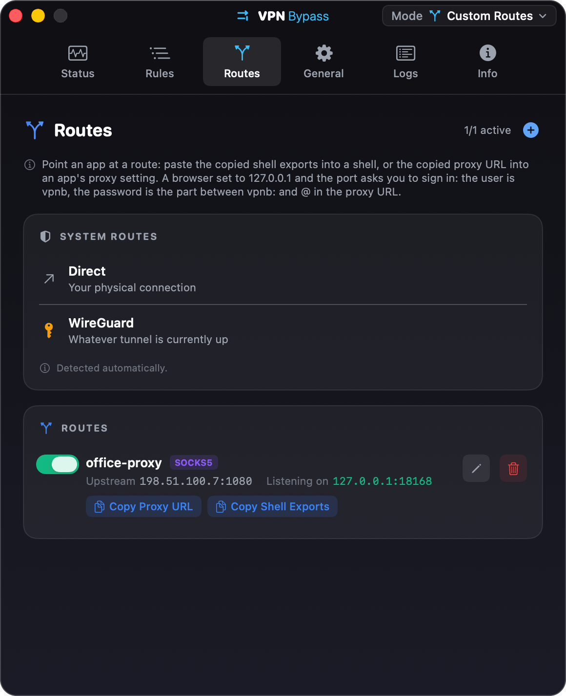
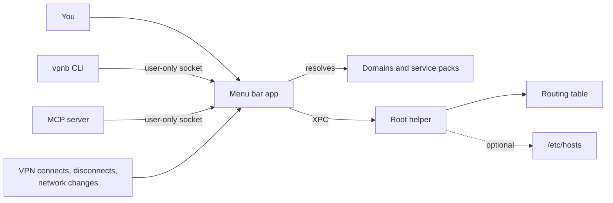

---
hide:
  - navigation
---

# VPN Bypass { .vb-visually-hidden }

  

  
  
  
  

---

**VPN Bypass** is a macOS menu bar app that decides which traffic goes through your VPN. In Bypass mode the services and domains you pick go straight to the internet and everything else stays on the VPN. VPN Only mode is the reverse, and Custom mode gives each rule its own exit. Install it with [Homebrew](getting-started.md), then pick a mode in [Routing modes](routing.md).

Corporate VPN clients send everything through the tunnel, so streaming stalls, AirPlay and Chromecast break, and personal traffic crosses the company network. Most clients lock their own split tunnelling, and a route added by hand is gone at the next reconnect or when a CDN moves. VPN Bypass adds the routes for you and puts them back every time the VPN or the network changes.

-   :material-apple: **[Install](getting-started.md)**

    ---

    Three Homebrew lines, or the DMG from Releases. Needs macOS 13 or later.

-   :material-play-circle-outline: **[First run](getting-started.md#first-run)**

    ---

    Approve one admin prompt, connect your VPN, turn on a service, and see what "working" looks like.

-   :material-menu: **[Everyday use](usage.md)**

    ---

    The dropdown, the Settings tabs, the `vpnb` command line and the [MCP server](mcp-server.md) for AI agents.

-   :material-source-branch: **[Routing modes](routing.md)**

    ---

    Bypass, VPN Only and Custom: routes, rules and the first-match order.

## The menu bar app

Everything lives in the dropdown: the VPN it found, a pill that says whether routes are enforced, the Mode switch, a field to add a domain, and the services and routes in use. Settings opens from the gear at its foot. See [Usage](usage.md).

<figure markdown>

<figcaption>Bypass mode</figcaption>
</figure>
<figure markdown>

<figcaption>First run</figcaption>
</figure>
<figure markdown>

<figcaption>VPN Only mode</figcaption>
</figure>

## Settings

Bypass and VPN Only use the Domains and Services tabs. Custom mode swaps them for Rules and Routes. General holds launch at login, the helper, `/etc/hosts` and notifications; Logs and Info are for debugging. See [Settings](usage.md#settings).

{ width="580" }

<figure markdown>

<figcaption>Rules, first match wins</figcaption>
</figure>
<figure markdown>

<figcaption>Routes: where traffic can exit</figcaption>
</figure>

## What it changes on your Mac

- Host routes in the system routing table, one per resolved address of each domain or service pack you turned on. In Bypass mode they point at your local gateway, in VPN Only mode at the VPN interface, in Custom mode at whatever the matching rule says. The app removes its routes when you quit, when you choose Remove All Routes…, and when the VPN goes away.
- Entries in `/etc/hosts`, only if you turn on DNS bypass in Settings > General.
- One small root helper, installed once with your admin password as a launchd daemon. It is the only part that runs as root, it does nothing but add and remove routes and hosts entries, and it accepts requests from this app alone (pinned to the app's code hash). There is no Network Extension and no kernel extension, so nothing to approve in System Settings beyond the Login Items entry on macOS 13 and later.
- A config file and a log under `~/Library/Application Support/VPNBypass/`, plus a socket there that only your account can open, which is what `vpnb` and the [MCP server](mcp-server.md) talk to.

## How it runs

- The app watches the network interfaces and running processes. A tunnel counts as a VPN when it is up and has an IPv4 address in a VPN range; Tailscale counts only when it is an exit node. See [Supported VPN types](how-it-works.md#supported-vpn-types).
- When the VPN connects, disconnects, or the network changes, the routes are rebuilt. Domains are re-resolved on a schedule, so a route follows a CDN when its addresses rotate.
- With several tunnels up, Bypass and VPN Only act on one and leave the others alone; in Custom mode a VPN route can name a specific tunnel. See [Other VPNs and proxies](coexistence.md).
- Route verification, when on, pings the routed destinations and shows which ones answer.
- A proxy route is a listener on `127.0.0.1` that forwards to the proxy you gave it; a Tailscale peer route sends traffic out through a device already in your tailnet. The app runs no VPN of its own.

## What it does not do

- It does not route per application. Rules are about where traffic goes, never about which process sent it; that would need a Network Extension, which the app deliberately does not use.
- It never touches Tailscale's own range, loopback, or kernel-reserved addresses, whatever a rule asks for, and it never picks Tailscale as the VPN to act on. See [Addresses that are never touched](coexistence.md#addresses-that-are-never-touched).
- It is not notarized. The app is signed ad hoc, so Gatekeeper may call it damaged on first launch. The one-line fix is in [Troubleshooting](troubleshooting.md#app-wont-open-damaged-error-macos-gatekeeper).
- It does not change what your VPN client does with DNS. The `/etc/hosts` option works around a client that forces DNS through the tunnel; it does not switch that off.

## Privacy

- The app talks to no server of its own: no telemetry, no update check, no account. The only network activity it starts is resolving the domains you list, forwarding traffic to a proxy you configured, and, when route verification is on, pinging the routed destinations.
- Config, logs and proxy credentials stay in your account's Application Support folder. The Logs tab shows local events only.
- Proxy credentials live in the config file, readable by your account alone, and the local listener asks for them, so another account on the same Mac cannot spend them. `vpnb` reads passwords from standard input, never from the command line.

## Getting help

- If something does not work, read [Troubleshooting](troubleshooting.md) first, then open a [bug report](https://github.com/GeiserX/VPN-Bypass/issues/new?template=bug_report.yml) with the details it asks for.
- For a question, use the [question template](https://github.com/GeiserX/VPN-Bypass/issues/new?template=question.yml).
- To report a security problem, follow the [security policy](https://github.com/GeiserX/VPN-Bypass/blob/main/SECURITY.md) and do not open a public issue.
- What changed between versions is on the [Releases](https://github.com/GeiserX/VPN-Bypass/releases) page. Planned work is in the [roadmap](https://github.com/GeiserX/VPN-Bypass/blob/main/ROADMAP.md).
- To build it or send a fix, read [Development](development.md).

## License

VPN Bypass is released under the [GPL-3.0-or-later](https://github.com/GeiserX/VPN-Bypass/blob/main/LICENSE) license.
