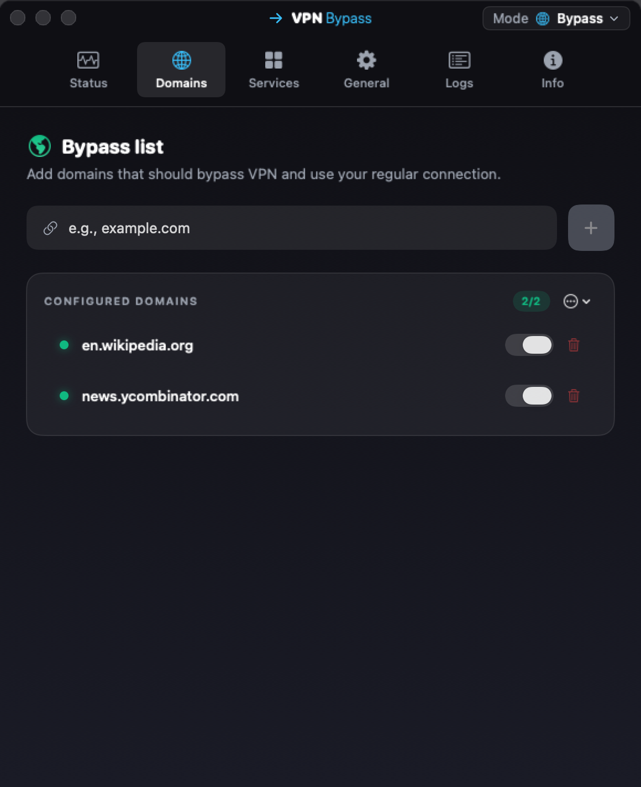

# Usage

## Menu bar

Click the VPN Bypass mark in the menu bar: two lines and a bar, with an arrow head on the top line while routes are enforced. The dropdown shows:

- the VPN it found and its type, and a pill that reads ON, NO ROUTES (nothing configured), NOT ENFORCING (the helper is down) or OFF (no VPN);
- the Mode switch, Bypass or VPN Only; in Custom mode a button back to Bypass;
- a field to add a domain to the current mode's list;
- the active services and routes;
- Refresh Routes, Clear and Verify Routes, and the gear that opens Settings.

{ width="340" }

## Settings

Click the gear icon to access settings. The tabs depend on the mode. Bypass: Domains, Services, General, Logs, Info. VPN Only: Domains, General, Logs, Info. Custom: Rules, Routes, General, Logs, Info.

{ width="580" }

{ width="580" }

Domains: add custom domains, enable/disable them individually, see resolved IPs.

Services: toggle built-in service packs (Telegram, YouTube, Spotify, …); each bundles known domains and IP ranges.

Rules (Custom mode): the ordered rule list (first match wins) mapping domains/suffixes/IPs/CIDRs/services/processes to routes.

Routes (Custom mode): your egresses: auto-detected Direct + VPN links, plus any proxy or Tailscale-peer routes you add.

General: launch at login, auto-apply on connect, `/etc/hosts` management, route verification, notification preferences, import/export, and network status (VPN type, interface, gateway, Wi-Fi SSID).

Logs: recent activity for debugging.

Info: version and helper status.

## Command-line control (`vpnb`)

A bundled `vpnb` CLI drives the same routing the GUI does, over a user-only UNIX socket, for scripting or a headless Mac. It needs no extra privilege (the app already holds it).

`vpnb` ships inside the app bundle (`VPN Bypass.app/Contents/MacOS/vpnb`). Installing via the Homebrew **tap** (`brew tap geiserx/vpn-bypass && brew install --cask vpn-bypass`) symlinks it onto your `PATH`. With a manual DMG install, call it by its full path (`"/Applications/VPN Bypass.app/Contents/MacOS/vpnb"`) or symlink it onto your `PATH` yourself.

```bash
vpnb status                                   # current mode, routes, schema/version
vpnb mode mode=custom                         # switch modes: bypass | vpnOnly | custom
vpnb route.add name=work type=socks5 host=127.0.0.1 port=1080
vpnb rule.add match=suffix pattern=example.com routeId=<uuid>
vpnb route.list ; vpnb rule.list
```

Secrets are never passed on the command line (argv is world-visible via `ps`). Pass the bare token `pass:-` and pipe the password on stdin:

```bash
read -rs PASS && printf '%s' "$PASS" | vpnb route.set id=<uuid> pass:-
```

Set `VPNB_SOCKET` to override the socket path (default: `~/Library/Application Support/VPNBypass/control.sock`).
